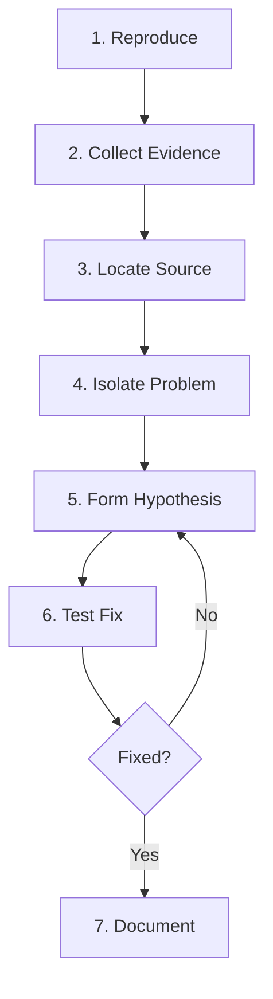

# Debugging Skill

This skill provides a **systematic approach** to debugging issues in the dictation practice app across both frontend and backend.

---

## Debugging Methodology



### Step-by-Step Process

1. **Reproduce the bug reliably**
   - Get exact steps to trigger
   - Note environment (browser, device, user state)

2. **Collect evidence**
   - Console errors and stack traces
   - Network requests/responses
   - Screenshots or recordings

3. **Locate the source**
   - UI issue → check CSS/HTML
   - Data issue → check API/backend
   - Logic issue → check JS/Python

4. **Isolate the problem**
   - Comment out code sections
   - Use breakpoints
   - Create minimal reproduction

5. **Form hypothesis**
   - What do you think causes it?
   - What would confirm/deny this?

6. **Test the fix**
   - Make smallest possible change
   - Verify original bug is fixed
   - Check for regressions

7. **Document the solution**
   - Update comments if needed
   - Add test if applicable

---

## Frontend Debugging

### Browser DevTools Panels

| Panel | Use For |
| :--- | :--- |
| **Console** | JS errors, logs, network errors |
| **Elements** | DOM inspection, CSS debugging |
| **Sources** | Breakpoints, step-through code |
| **Network** | API calls, timing, payloads |
| **Application** | LocalStorage, cookies |

### Console Methods

```javascript
// Basic logging
console.log('Value:', value);
console.error('Error:', error);
console.warn('Warning:', msg);

// Structured data
console.table(arrayOfObjects);
console.group('Section');
console.groupEnd();

// Timing
console.time('operation');
// ... code ...
console.timeEnd('operation');

// Breakpoint in code
debugger;
```

### Common Frontend Issues

| Symptom | Likely Cause | Check |
| :--- | :--- | :--- |
| Element not visible | CSS `display`, `visibility`, `z-index` | Elements panel |
| Click not working | Event handler, overlay blocking | Console, Elements |
| API call fails | CORS, auth, network | Network panel |
| Animation janky | Layout thrashing, forced reflows | Performance panel |

---

## Backend Debugging

### Logging Pattern

```python
import logging

logging.basicConfig(level=logging.DEBUG)
logger = logging.getLogger(__name__)

def analyze_audio(audio_path, expected_syllables):
    logger.info(f"Processing: {audio_path}")
    logger.debug(f"Expected syllables: {expected_syllables}")
    
    try:
        result = process(audio_path)
        logger.info(f"Success: {len(result['syllables'])} syllables")
        return result
    except Exception as e:
        logger.error(f"Failed: {e}", exc_info=True)
        raise
```

### Common Backend Issues

| Symptom | Likely Cause | Check |
| :--- | :--- | :--- |
| 500 error | Exception in handler | Server logs |
| 404 error | Wrong URL or method | Route definitions |
| CORS error | Missing headers | Flask-CORS config |
| Empty response | Missing return/jsonify | Handler code |

---

## Debugging by Error Type

### `TypeError: Cannot read properties of undefined`

```javascript
// Problem: Accessing property of undefined
data.syllables.forEach(s => ...)

// Solution: Add null checks
if (data?.syllables) {
    data.syllables.forEach(s => ...)
}
```

### `KeyError` in Python

```python
# Problem: Key missing from dict
pitch = syllable['avgPitch']

# Solution: Use .get() with default
pitch = syllable.get('avgPitch', 0)
```

### `z-index not working`

```css
/* Problem: z-index only works with positioned elements */
.element {
    z-index: 9999; /* Won't work */
}

/* Solution: Add position */
.element {
    position: relative; /* or fixed/absolute */
    z-index: 9999;
}
```

---

## Quick Debugging Commands

```bash
# Check if server is running
curl http://localhost:8080/health

# Test API endpoint
curl -X POST -F "audio=@test.wav" http://localhost:8080/analyze

# View Python logs
python server.py 2>&1 | tee debug.log

# Check port in use (Windows)
netstat -ano | findstr :8080

# Kill process on port (Windows)
taskkill /PID <pid> /F
```

---

## Debugging Checklist

### Before Investigating

- [ ] Can I reproduce the bug?
- [ ] What are the exact steps?
- [ ] What browser/device/environment?

### During Investigation

- [ ] Check console for errors
- [ ] Check network tab for failed requests
- [ ] Add strategic console.log/print statements
- [ ] Use breakpoints to step through code

### After Fixing

- [ ] Does the original bug still occur?
- [ ] Did I introduce any new bugs?
- [ ] Should I add a test for this?
