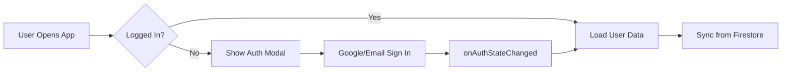

# Firebase Auth & Firestore Skill

This skill covers **Firebase integration** for authentication and cloud data storage in the dictation practice app.

## Project Context

Key files:

- `firebase-auth-module.js` - Auth logic
- `firebase-firestore-module.js` - Cloud data sync
- `auth-ui.js` - Login/signup UI
- `firestore.rules` - Security rules

---

## Authentication Flow



---

## Auth Patterns

### Initialize Firebase

```javascript
import { initializeApp } from 'firebase/app';
import { getAuth, onAuthStateChanged } from 'firebase/auth';

const app = initializeApp(firebaseConfig);
const auth = getAuth(app);

onAuthStateChanged(auth, (user) => {
    if (user) {
        loadUserData(user.uid);
    } else {
        showLoginModal();
    }
});
```

### Google Sign-In

```javascript
import { GoogleAuthProvider, signInWithPopup } from 'firebase/auth';

async function signInWithGoogle() {
    const provider = new GoogleAuthProvider();
    try {
        const result = await signInWithPopup(auth, provider);
        return result.user;
    } catch (error) {
        if (error.code === 'auth/popup-closed-by-user') {
            // User closed popup, handle gracefully
        }
        throw error;
    }
}
```

---

## Firestore Patterns

### Document Structure

```text
users/{userId}/
├── profile/          # User settings
├── progress/         # Learning progress
├── srsData/          # Spaced repetition data
└── vocab/            # Saved vocabulary
```

### Read/Write Pattern

```javascript
import { doc, getDoc, setDoc, updateDoc } from 'firebase/firestore';

// Read
async function getUserProgress(userId) {
    const docRef = doc(db, 'users', userId, 'progress', 'main');
    const docSnap = await getDoc(docRef);
    return docSnap.exists() ? docSnap.data() : null;
}

// Write with merge
async function updateProgress(userId, data) {
    const docRef = doc(db, 'users', userId, 'progress', 'main');
    await setDoc(docRef, data, { merge: true });
}
```

---

## Offline/Online Sync Strategy

```javascript
// 1. Always write to LocalStorage first (instant)
localStorage.setItem('userProgress', JSON.stringify(progress));

// 2. Then sync to Firestore (async, may fail)
try {
    await updateFirestoreProgress(progress);
} catch (error) {
    // Queue for retry when online
    queueForSync(progress);
}

// 3. On app load, merge local + cloud data
const local = JSON.parse(localStorage.getItem('userProgress'));
const cloud = await getFirestoreProgress();
const merged = mergeProgress(local, cloud);
```

---

## Security Rules Pattern

```javascript
// firestore.rules
rules_version = '2';
service cloud.firestore {
  match /databases/{database}/documents {
    // Users can only access their own data
    match /users/{userId}/{document=**} {
      allow read, write: if request.auth != null 
                         && request.auth.uid == userId;
    }
  }
}
```

---

## Common Issues & Solutions

### Issue: Auth state not persisting

**Fix**: Use `setPersistence(auth, browserLocalPersistence)`

### Issue: Firestore quota exceeded

**Fix**: Batch writes, debounce saves, cache reads

### Issue: Popup blocked

**Fix**: Fallback to `signInWithRedirect`

### Issue: CORS errors

**Fix**: Check authorized domains in Firebase Console

---

## Testing Checklist

- [ ] Login with Google works
- [ ] Login with email/password works
- [ ] User data persists across sessions
- [ ] Offline changes sync when online
- [ ] Logout clears session properly
- [ ] Security rules block unauthorized access
