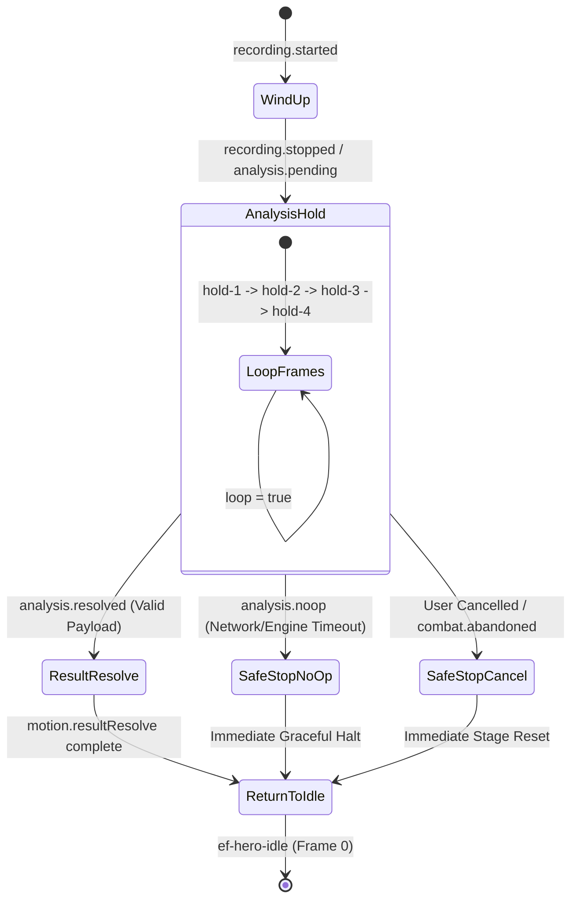

# Echo Forge UI State Matrix & Visual Specification

**Contract Version**: `echo-forge-visual-v1`  
**Author**: Claude (Visual System Designer)  
**Target File**: `docs/echo-forge/claude/ui-state-matrix.md`  
**Status**: Production Specification  
**Design Tokens**: BEL Surface Palette (Background `#0f172a`, Surface `#1e293b`, Accent Primary `#1a73e8`, Font: *Outfit*), Contract Palette (*Slate*, *Violet*, *Cyan*, *Amber*)

---

## 1. System Architecture & Visual Contract Overview

Echo Forge is a pronunciation-combat RPG where learners speak English phonemes, words, and phrases to attack, block, and parry incoming attacks from training constructs.

### 1.1 Separation of Responsibilities

```text
┌─────────────────────────────────────────────────────────────────────────┐
│                    PROTECTED SERVER / ENGINE CORE                       │
│  - Speech Recognition & Scoring Math (Azure Speech / V3 Phoneme)        │
│  - Combat Resolution & Damage Formulas (Base × Accuracy × Combo)        │
│  - Account Progression, Level Gating (A1–C1), Firestore Persistence    │
│  - Telemetry Pipeline & Reason Code Determination                       │
└────────────────────────────────────┬────────────────────────────────────┘
                                     │ Normalized Event Payloads
                                     ▼
┌─────────────────────────────────────────────────────────────────────────┐
│                     CLAUDE VISUAL PRESENTATION LAYER                    │
│  - 21 Immutable Event Mappings & Sprite Compositing                     │
│  - HUD State Synchronization (Health, Focus, Resonance, Mic Status)    │
│  - Motion Grammar Execution (windUp → analysisHold → resolve → idle)    │
│  - WCAG-AA Accessibility, Live Regions (combat.status), Static Fallback │
│  - 44×44 CSS px Touch Targets & Responsive 360px Mobile Safe-Cropping   │
└─────────────────────────────────────────────────────────────────────────┘
```

> [!IMPORTANT]
> **Presentation Isolation**: The visual layer consumes normalized event payloads only. It **never** calculates damage, reinterprets scores, infers learner verdicts, mutates account progression, or executes telemetry calls. Technical failures (`analysis.noop`) are treated strictly as **neutral system states**, never as learner failure.

---

## 2. Asset Slot Definitions

The shared visual contract specifies three immutable asset slots. Duplicate `assetId` values or unauthorized dimensions invalidate the contract.

| Asset Slot ID | Dimensions | Frame Count | Frame Sequence Order | Pivot `(x, y)` | Transparent Padding | Z-Order | Palette Constraints | Loop Mode | Static Fallback | Timing Variable |
| :--- | :---: | :---: | :---: | :---: | :---: | :---: | :--- | :---: | :---: | :--- |
| `ef-hero-idle` | 256×256 px | 1 | `["idle"]` | `(128, 224)` | Top: 16, Right: 16, Bottom: 16, Left: 16 | 20 | `slate`, `violet`, `cyan` | `false` | Frame 0 (`idle`) | `motion.idle` |
| `ef-analysis-hold` | 256×256 px | 4 | `["hold-1", "hold-2", "hold-3", "hold-4"]` | `(128, 128)` | Top: 24, Right: 24, Bottom: 24, Left: 24 | 40 | `slate`, `violet`, `cyan` | `true` | Frame 0 (`hold-1`) | `motion.analysisHold` |
| `ef-combat-result` | 320×320 px | 3 | `["wind-up", "resolve", "return"]` | `(160, 288)` | Top: 20, Right: 20, Bottom: 20, Left: 20 | 30 | `slate`, `violet`, `cyan`, `amber` | `false` | Frame 1 (`resolve`) | `motion.resultResolve` |

---

## 3. Comprehensive 21-Event UI State Matrix

The table below maps all 21 contract events to their exact Hero state, Enemy state, HUD updates, ARIA live-region status text (`combat.status`), static fallback behavior, active asset slots, and motion grammar transitions.

| # | Contract Event Name | Hero Visual State (Slot & Frame) | Enemy Visual State | HUD Component Updates | Status Text (`combat.status` hook) | Static Fallback Description (`prefers-reduced-motion`) | Active Asset Slots | Motion Transition State |
| :-: | :--- | :--- | :--- | :--- | :--- | :--- | :--- | :--- |
| **1** | `sandbox.setup.completed` | `ef-hero-idle`<br>Frame 0 (`idle`) | Construct Neutral Hover at rest (`y: 224`) | Hero HP: 100%, Enemy HP: 100%, Focus: 1/3 pips, Resonance: 0%, Mic: Standby | `"Battle arena initialized. Select an action to begin."` | Static Hero ready pose, Enemy hover posture, initialized HUD gauges, static readiness icon. | `ef-hero-idle` | `none` |
| **2** | `combat.started` | `ef-hero-idle`<br>Frame 0 (`idle`) | Construct Neutral Hover, ambient core pulse | Turn counter active, Action Drawer unlocked (Attack, Block, Parry cards interactive ≥44×44px) | `"Combat engaged. Round 1. Choose your pronunciation action."` | Static Hero ready stance, Enemy hover posture, interactive cards with high-contrast focus rings. | `ef-hero-idle` | `none` |
| **3** | `player.action.selected` | `ef-hero-idle`<br>Frame 0 (`idle`) | Construct Neutral Hover | Selected card highlighted with cyan border; Challenge phrase banner displayed; Mic button active | `"Action selected: [Action Name]. Microphone ready. Speak to execute."` | Selected action card retains active outline; static target phrase text card; static "Ready to Record" button. | `ef-hero-idle` | `windUp` |
| **4** | `recording.started` | `ef-hero-idle`<br>Frame 0 (`idle`)<br>*(Vocal projection stance)* | Construct Neutral Hover | Recording Indicator: Active (cyan badge + live waveform visualizer + accessible label `"Recording active... Speak now"`); Actions locked; Cancel button ready | `"Recording active. Speak clearly into microphone."` | High-contrast non-pulsing recording pill (`"● RECORDING"`), static waveform capture graphic, accessible label. | `ef-hero-idle` | `windUp` |
| **5** | `recording.stopped` | `ef-hero-idle`<br>Frame 0 (`idle`) | Construct Neutral Hover | Recording Indicator: Processing (badge `"Audio captured"` in violet); Mic button disabled | `"Recording stopped. Processing audio..."` | Static "Audio Captured" badge; recording pill transitions to neutral slate processing state. | `ef-hero-idle` | `windUp` |
| **6** | `analysis.pending` | `ef-hero-idle`<br>Frame 0 (`idle`) | Construct Neutral Hover | Analysis Mandala overlay active; HUD controls disabled; Status badge: `"Analyzing Pronunciation..."` | `"Analyzing pronunciation..."` | Static 4-node harmonic mandala (`ef-analysis-hold` Frame 0), no rotation, text `"Analyzing..."`. | `ef-analysis-hold` | `analysisHold` |
| **7** | `analysis.resolved` | `ef-combat-result`<br>Frame 0 (`wind-up`) | Construct Neutral Hover | Analysis Mandala dismisses; Pronunciation score badge & accuracy breakdown card displayed | `"Analysis complete. Accuracy evaluated."` | Static accuracy badge (e.g. `"92% Accurate"`), instantaneous dismissal of hold overlay, no tweening. | `ef-analysis-hold`, `ef-combat-result` | `resolve` |
| **8** | `analysis.noop` | `ef-hero-idle`<br>Frame 0 (`idle`) | Construct Neutral Hover | Neutral System Notice banner: `"Analysis unavailable — no combat judgment was made"`; HP/Focus unchanged; Retry button unlocked | `"Analysis unavailable — no combat judgment was made"` | Static slate/cyan info banner with icon; zero flashing/screenshake; retry control with clear focus indicator. | `ef-hero-idle` | `returnToIdle` |
| **9** | `player.attack.resolved` | `ef-combat-result`<br>Frame 1 (`resolve`) → Frame 2 (`return`) | Construct Hit / Recoil pose (core flash, chassis recoil) | Enemy HP bar decreases by payload damage; Floating damage number appears; Focus/Resonance increment per payload | `"Attack landed! [Damage] damage dealt."` | Static strike impact graphic (`ef-combat-result` Frame 1), static Enemy recoil pose, instantaneous HP bar update. | `ef-combat-result` | `resolve` → `returnToIdle` |
| **10** | `enemy.intent.presented` | `ef-hero-idle`<br>Frame 0 (`idle`) | Construct Telegraph Pose (pylons raised, amber runes orbiting) | Enemy Intent Banner displayed above enemy (e.g. `"Incoming Sonic Strike - 20 Dmg"`); Block & Parry cards highlighted | `"Enemy telegraphed incoming attack: [Attack Type]. Prepare to Block or Parry."` | Static enemy telegraph posture with persistent amber intent icon (`[ ! ]`) and full textual attack description. | `ef-hero-idle` | `none` |
| **11** | `player.block.resolved` | `ef-combat-result`<br>Frame 1 (`resolve`)<br>*(Acoustic shield)* | Construct Attack Release / Recovery | Hero HP bar decreases only by mitigated amount from payload; Block mitigation badge displayed; Focus updated | `"Block successful! [Damage] damage absorbed."` | Static Hero Guard posture with honeycomb shield overlay (`ef-combat-result` Frame 1), static mitigated damage callout. | `ef-combat-result` | `resolve` → `returnToIdle` |
| **12** | `player.parry.started` | `ef-combat-result`<br>Frame 0 (`wind-up`)<br>*(Parry counter stance)* | Construct Forward Attack Strike | Parry timing window indicator active; Challenge text displayed; Mic active with parry prompt | `"Parry initiated. Pronounce the counter-phrase now!"` | Static parry wind-up keyframe with high-contrast target phrase banner and countdown text. | `ef-combat-result` | `windUp` |
| **13** | `player.parry.resolved` | `ef-combat-result`<br>Frame 1 (`resolve`) → Frame 2 (`return`) | Construct Stunned / Disjointed (cyan electrical arcing) | Enemy HP bar reduced by reflected damage; Enemy gains `"STUNNED"` badge; Resonance bonus added; Hero HP unaffected | `"Perfect Parry! Attack reflected, enemy stunned."` | Static diamond parry deflection graphic (`ef-combat-result` Frame 1), static Enemy stun pose, persistent `"STUNNED"` label. | `ef-combat-result` | `resolve` → `returnToIdle` |
| **14** | `combat.damage.applied` | `ef-combat-result`<br>Frame 1 (`resolve`) *(if Hero)* or `ef-hero-idle` | Construct Hit Pose *(if Enemy)* or Forward Thrust *(if Hero)* | Target HP bar decreases to payload value; Floating damage text displayed; Low HP warning if <25% | `"Damage applied: [Target] received [Damage] damage."` | Instantaneous HP bar update to target percentage; static floating damage text callout; no camera shake. | `ef-combat-result` | `resolve` → `returnToIdle` |
| **15** | `combat.focus.changed` | `ef-hero-idle`<br>Frame 0 (`idle`) | Construct Neutral Hover | Focus Meter pips fill/empty to match payload count (1/3, 2/3, 3/3); Focus ability buttons update availability | `"Focus updated: [Count] of 3 pips available."` | Discrete pip fill state changes (filled diamonds vs outline diamonds) with textual ratio `"1/3"`, `"2/3"`, `"3/3"`. | `ef-hero-idle` | `none` |
| **16** | `combat.resonance.ready` | `ef-hero-idle`<br>Frame 0 (`idle`)<br>*(Resonance aura)* | Construct Neutral Hover | Resonance Gauge fills to 100% (amber/cyan glow); Resonance Burst button unlocked with badge `"Resonance Ready (100%)"` | `"Resonance fully charged! Resonance Burst ready to activate."` | Solid amber/cyan filled gauge with static badge `"RESONANCE MAX"`; Burst button enabled with high-contrast border. | `ef-hero-idle` | `none` |
| **17** | `combat.resonance.consumed` | `ef-hero-idle`<br>Frame 0 (`idle`) | Construct Neutral Hover | Resonance Gauge resets to 0% (or payload value); Burst indicator clears; Focus/Damage modifiers applied | `"Resonance Burst unleashed!"` | Resonance gauge resets immediately to 0%; static burst discharge graphic; HUD returns to standard state. | `ef-hero-idle` | `windUp` → `resolve` |
| **18** | `combat.victory` | `ef-combat-result`<br>Frame 1 (`resolve`)<br>*(Blade skyward)* | Construct Shattered / Collapsed on ground plane (`y: 224`) | Victory Overlay Modal appears; Score/accuracy summary displayed; Action cards disabled; `"Continue"` button active | `"Victory achieved! Training construct neutralized."` | Static Hero victory pose, static shattered construct scrap pile, high-contrast modal with full text summary. | `ef-combat-result` | `resolve` |
| **19** | `combat.defeat` | `ef-combat-result`<br>Frame 1 (`resolve`)<br>*(Kneeling posture)* | Construct Victorious Hover (looming altitude, violet blaze) | Defeat Modal Overlay appears; Practice breakdown and pronunciation feedback displayed; `"Retry"` button active | `"Defeat. Training construct overpowered your defenses."` | Static Hero kneeling pose, static victorious enemy hover, high-contrast modal with retry actions and feedback. | `ef-combat-result` | `resolve` |
| **20** | `combat.abandoned` | `ef-hero-idle`<br>Frame 0 (`idle`) | Construct Neutral Hover (fading to inert) | Combat stage closes; Navigation returns to training hub; Action controls disabled | `"Training session ended"` | Immediate reset of combat canvas to clean hub state; static session summary banner with keyboard focus. | `ef-hero-idle` | `none` |
| **21** | `telemetry.exported` | `ef-hero-idle`<br>Frame 0 (`idle`) | Construct preserves current state | Silent HUD background sync indicator (or debug badge); zero layout disruption | `"Combat telemetry logged successfully."` | Silent background state; static sync confirmation icon in developer/debug HUD mode; zero layout shift. | `ef-hero-idle` | `none` |

---

## 4. Motion Grammar Architecture

The visual engine enforces a strict 4-phase motion grammar to bridge player speech input, asynchronous cloud analysis, and server-authoritative combat resolution.

```text
┌─────────────────┐       ┌──────────────────────────────┐       ┌──────────────────────────┐       ┌─────────────────┐
│     WIND-UP     │  ──▶  │        ANALYSIS-HOLD         │  ──▶  │     RESULT RESOLVE       │  ──▶  │ RETURN TO IDLE  │
│ Player Action / │       │ Loopable & Safe-Cancellable  │       │ Server Outcome Rendered  │       │ Canvas Returns  │
│ Mic Recording   │       │ Waiting for Analyzer Payload │       │ Hit / Block / Parry / NoOp│      │ to Rest Stance  │
└─────────────────┘       └──────────────────────────────┘       └──────────────────────────┘       └─────────────────┘
```

### 4.1 Phase 1: `windUp`
- **Trigger Events**: `player.action.selected`, `recording.started`, `recording.stopped`, `player.parry.started`.
- **Purpose**: Gives instantaneous tactile and visual feedback that user interaction was captured and speech intake is live.
- **Visual Treatment**: The Hero enters an acoustic ready posture (blade raised, vocal node primed). The microphone indicator illuminates with a pulsing cyan ring (`#06b6d4`).
- **Timing Variable**: Controlled dynamically by client recording duration; transitions to `analysisHold` immediately upon `recording.stopped`.

### 4.2 Phase 2: `analysisHold`
- **Trigger Events**: `analysis.pending`.
- **Purpose**: Maintains a clear, visually engaging, non-blocking hold state while the backend speech analyzer (Azure Speech API or V3 Phoneme engine) processes the audio stream.
- **Looping Mechanics**: 
  - Utilizes `ef-analysis-hold` (4 frames: `hold-1` → `hold-2` → `hold-3` → `hold-4`).
  - Loops continuously at an engine-controlled rate specified by `motion.analysisHold`.
  - Frame sequence represents a 4-node rotating harmonic acoustic ring centered at `(128, 128)`.
- **Readability Rules**:
  - The hold mandala must maintain a minimum contrast ratio of 4.5:1 against the `#0f172a` battle background.
  - Characters remain clearly visible beneath the mandala (mandala opacity capped at 85%).
  - Text badge `"Analyzing Pronunciation..."` is rendered below the mandala in *Outfit* 16px font with high-contrast white text (`#f8fafc`).

### 4.3 Phase 3: `resolve`
- **Trigger Events**: `analysis.resolved`, `player.attack.resolved`, `player.block.resolved`, `player.parry.resolved`, `combat.damage.applied`, `combat.victory`, `combat.defeat`.
- **Purpose**: Renders the definitive, server-adjudicated combat outcome.
- **Visual Treatment**: 
  - `ef-combat-result` plays Frame 0 (`wind-up`) → Frame 1 (`resolve`).
  - Impacts, damage numbers, health bar deltas, and enemy recoil animations execute in exact sync with the `motion.resultResolve` timing variable.
  - For critical hits (accuracy > 90%), amber acoustic fracture particles disperse at 45° angles.

### 4.4 Phase 4: `returnToIdle`
- **Trigger Events**: Completion of `resolve` phase, `analysis.noop`, `combat.focus.changed`.
- **Purpose**: Smoothly restores character sprites and stage elements to their baseline rest positions.
- **Visual Treatment**: `ef-combat-result` plays Frame 2 (`return`) and seamlessly hands rendering back to `ef-hero-idle` (Frame 0) and the Enemy Neutral Hover pose.

---

## 5. Safe-Stop & Technical Failure Handling

Echo Forge maintains a strict policy regarding network timeouts, microphone disconnects, speech engine unreachability, and learner cancellation.



### 5.1 Safe-Stop Behavioral Rules
1. **Immediate Loop Termination**: When `analysis.noop` or `combat.abandoned` is received, the `ef-analysis-hold` loop halts immediately on its current frame without waiting for the 4-frame cycle to finish.
2. **Neutral System State Policy**:
   - Technical failures are never displayed as learner mistakes, "Misses", or "Zero Scores".
   - The status text hook (`combat.status`) **must** output:  
     `"Analysis unavailable — no combat judgment was made"`
   - No damage is applied to the player or enemy. Focus and Resonance meters are fully preserved.
3. **Action Drawer Restoration**:
   - Action buttons (Attack, Block, Parry) return to an interactive state with clear keyboard focus.
   - A neutral slate/cyan retry banner offers a 1-click retry option (≥44×44 CSS px).

---

## 6. Timing Variables & Engine Integration

The visual presentation layer contains **zero hardcoded millisecond durations**. All state animations bind strictly to named engine timing variables supplied by the runtime environment.

| Named Timing Variable | Contract Asset Slot | Default Target Cadence | Motion Behavior & Curve | Cancellation Hook |
| :--- | :--- | :---: | :--- | :--- |
| `motion.idle` | `ef-hero-idle` | Static / 1.0 Hz hover | `ease-in-out` breathing curve; subtle ±2px vertical displacement of enemy construct. | Always active at rest. |
| `motion.analysisHold` | `ef-analysis-hold` | ~120ms per frame (480ms cycle) | Linear continuous rotation (90° per frame); opacity pulse between 70% and 100%. | Aborted immediately on `analysis.resolved`, `analysis.noop`, or `combat.abandoned`. |
| `motion.resultResolve` | `ef-combat-result` | ~100ms wind-up, 250ms resolve hold, 150ms return | `cubic-bezier(0.16, 1, 0.3, 1)` (snappy ease-out impact with elastic settle). | Non-cancellable; plays to completion once server payload is received. |

---

## 7. Accessibility & Screen Reader Specification (WCAG 2.1 AA)

### 7.1 Screen Reader Live-Region Contract (`combat.status`)
All dynamic combat announcements flow through a dedicated ARIA live region with `aria-live="polite"` and `aria-atomic="true"`.

```html
<!-- Semantic Battle Arena Accessibility Live Region -->
<div 
  id="ef-combat-status-live" 
  class="sr-only" 
  role="status" 
  aria-live="polite" 
  aria-atomic="true"
  data-hook="combat.status">
  Battle arena initialized. Select an action to begin.
</div>
```

### 7.2 Non-Color-Only Information Architecture
No game state or combat mechanic is communicated solely through color:

| HUD Dimension | Color Indicator | Non-Color Redundant Indicator | ARIA / Text Attribute |
| :--- | :--- | :--- | :--- |
| **Health Bar** | Green (>50%), Amber (25–50%), Red (<25%) | Numeric text (`"85 / 100 HP"`), segmented tick marks at 25% increments | `aria-valuenow="85" aria-valuemin="0" aria-valuemax="100"` |
| **Focus Meter** | Glowing Cyan (`#06b6d4`) | Segmented diamond icons (◆ filled vs ◇ empty) + text `"2 / 3 Focus"` | `aria-label="Focus: 2 of 3 pips ready"` |
| **Resonance Gauge** | Amber Sparkle (`#f59e0b`) | Text badge `"RESONANCE 100% (READY)"` + pulsing soundwave icon | `aria-label="Resonance fully charged: Burst available"` |
| **Enemy Intent** | Amber Telegraph (`#f59e0b`) | Triangular warning badge `[ ! ]` + attack type label `"Heavy Sonic Strike (25 Dmg)"` | `aria-label="Enemy intent: Heavy Sonic Strike dealing 25 damage"` |
| **Analysis Status** | Violet / Cyan Waveform | Rotating harmonic mandala + text `"Analyzing Pronunciation..."` | `aria-busy="true"` |
| **Technical No-Op** | Slate / Cyan Banner (`#334155`) | Neutral info badge `[ i ]` + text `"Analysis unavailable — no combat judgment was made"` | `role="alert"` |

### 7.3 Touch Targets & Keyboard Navigation
- **Target Dimensions**: All interactive elements (Action Cards, Mic Button, Burst Button, Modal Actions) have a minimum clickable/tappable footprint of **48×48 CSS px** (exceeding the 44×44px minimum).
- **Keyboard Traversal**: Full `Tab` / `Shift+Tab` sequential navigation through action cards; `Space` / `Enter` for activation; `Escape` for cancellation.
- **Focus Rings**: High-contrast 3px solid cyan outline (`#06b6d4`) with 2px offset (`offset-dark #0f172a`).

---

## 8. Reduced Motion & Responsive Cropping Rules

### 8.1 Reduced Motion Contract (`prefers-reduced-motion: reduce`)
When reduced motion is requested:
1. **Zero Animated Transitions**: Sprites switch immediately between static keyframes without position tweening, scaling, or screen shake.
2. **Static Fallback Frames**:
   - `ef-hero-idle`: Frame 0 (`idle`).
   - `ef-analysis-hold`: Frame 0 (`hold-1`) rendered as a static 4-node harmonic mandala.
   - `ef-combat-result`: Frame 1 (`resolve`) rendered as a crisp, static impact snapshot.
3. **Equal Visual Information**: All damage numbers, badges, and feedback metrics remain visible on screen for a minimum duration to allow full comprehension before returning to idle.

### 8.2 Responsive Mobile Safe-Cropping (360px Viewport)

```text
┌────────────────────────────────────────────────────────┐
│ 360px Viewport Stage Bounds                            │
│                                                        │
│  ┌──────────────────────┐    ┌──────────────────────┐  │
│  │ Hero Slot (256x256)  │    │ Enemy Slot (256x256) │  │
│  │ Safe Crop (224x224)  │    │ Safe Crop (224x224)  │  │
│  │ [16px Safe Margin]   │    │ [16px Safe Margin]   │  │
│  │ Pivot (128, 224)     │    │ Pivot (128, 224)     │  │
│  └──────────────────────┘    └──────────────────────┘  │
│                                                        │
│ ┌────────────────────────────────────────────────────┐ │
│ │ Combat Result FX Slot (320x320, Crop 272x272)      │ │
│ └────────────────────────────────────────────────────┘ │
└────────────────────────────────────────────────────────┘
```

- **Canvas Safe Boundaries**: All character silhouettes and crucial visual cues are constrained within the inner `224×224` mobile safe crop area (`x: 16..240, y: 16..240`).
- **Zero Horizontal Scroll**: Arena layout flexes to fit 360px mobile screens without clipping or horizontal overflow.
- **Z-Order Compositing Layer Stack**:
  1. `z-index: 10` — Background Arena & Ambient Waveforms
  2. `z-index: 15` — Focus / Heal Aura Particle Effects (`ef-effect-focus`)
  3. `z-index: 20` — Hero & Enemy Base Idle Sprites (`ef-hero-idle`, Enemy Construct)
  4. `z-index: 25` — Block Shield Energy Barriers (`ef-effect-block`)
  5. `z-index: 30` — Combat Result & Impact Effects (`ef-combat-result`)
  6. `z-index: 40` — Analysis Hold Mandala Overlay (`ef-analysis-hold`)
  7. `z-index: 50` — HUD Gauges, Action Drawer & Floating Combat Text
  8. `z-index: 60` — Modal Overlays (Victory, Defeat, System Notices)

---

## 9. Verification & Implementation Checklist

- [x] All 21 contract events explicitly defined with Hero, Enemy, HUD, Status Text, Static Fallback, Active Asset Slots, and Motion Transition.
- [x] All 3 immutable asset slots (`ef-hero-idle`, `ef-analysis-hold`, `ef-combat-result`) accurately mapped.
- [x] Strict compliance with neutral system state rule for `analysis.noop`.
- [x] Exact status text strings verified for `analysis.noop` and `combat.abandoned`.
- [x] Motion grammar progression (`windUp` → `analysisHold` → `resolve` → `returnToIdle`) fully documented.
- [x] Safe-stop and cancellation behavior defined for all asynchronous states.
- [x] Named timing variables (`motion.idle`, `motion.analysisHold`, `motion.resultResolve`) linked to motion states.
- [x] WCAG-AA accessibility, ARIA live-region hooks (`combat.status`), and static fallbacks verified.
- [x] Responsive 360px safe-cropping and z-index layer stack defined.
