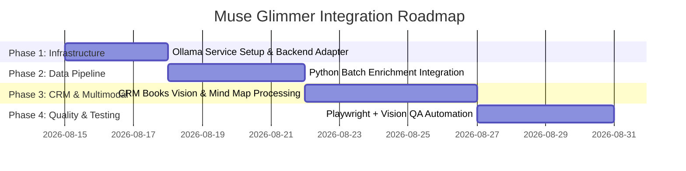

# Muse Glimmer (30B): Technical Research & Integration Proposal

> **Document Status**: Draft / Proposal  
> **Date**: August 12, 2026  
> **Source Model**: [Muse Glimmer on Ollama](https://ollama.com/library/muse-glimmer)  
> **Target Project**: PTE Practice / Speech Coach & CRM Books Platform (`demoproject`)

---

## 1. Executive Summary

**Muse Glimmer** (`muse-glimmer:30b`) is Meta’s open-weights 30-billion parameter causal language model with a dedicated perception encoder, distilled from *Muse Spark*. Built under the **Apache 2.0** license, it is explicitly engineered for **always-on, local agentic tasks on consumer hardware** without relying on cloud infrastructure or external API subscriptions.

This document synthesizes our research on Muse Glimmer and outlines a structured proposal to integrate it into our project ecosystem as a zero-cost, privacy-preserving local AI engine for practice evaluation, dataset enrichment, multimodal CRM document processing, and automated visual QA testing.

---

## 2. Model Specifications & Benchmark Performance

### Key Technical Specifications

| Specification | Value | Notes |
| :--- | :--- | :--- |
| **Developer / License** | Meta · Apache 2.0 | Fully open-source for commercial and private use |
| **Parameter Count** | 30 Billion Parameters | Distilled from Muse Spark |
| **Context Window** | 128,000 Tokens (128K) | Supports long documents & multi-turn conversations |
| **Download Size** | 18 GB (`latest` / `30b`) · 21 GB (`30b-mlx`) | 4-bit quantized default; MLX optimized for Apple Silicon |
| **Modalities** | Multimodal (Text + Image Input) | Dedicated perception encoder for visual inputs |
| **Hardware Requirement**| Single GPU (24GB VRAM) or Apple Silicon (32GB+ RAM) | Runs locally via Ollama (`http://localhost:11434`) |

### Core Architectural Features

1. **End-to-End Agentic Execution**: Tuned for multi-step reasoning, tool execution, and long-horizon planning.
2. **Built-in Failure Recovery**: If a function call or tool execution fails or returns an error, the model diagnoses the failure and retries automatically rather than halting.
3. **Structured Function & Tool Use**: Native support for complex JSON tool schemas and Model Context Protocol (MCP).
4. **Multimodal Perception**: Accepts interleaved text and images (screenshots, charts, scanned document pages, UI wireframes).
5. **Controllable Reasoning Effort**: Supports dynamic thinking/reasoning modes (Low/Medium/High) to balance throughput speed vs. reasoning depth.

### Benchmark Summary (vs. 30B Class Competitors)

| Category | Benchmark | Muse Glimmer-30B (High Reasoning) | Gemma4-31B | Qwen3.6-27B |
| :--- | :--- | :---: | :---: | :---: |
| **General Agentic** | MCP Atlas (Public) | **75.5** | 54.2 | 62.5 |
| | DeepSearch QA | **74.6** | 61.7 | 71.1 |
| | Gaia2 | **43.3** | 36.4 | 40.0 |
| **Agentic Coding** | SWE-Bench Pro | **51.2** | 36.9 | 50.2 |
| | SWE-Bench Verified | 76.0 | 66.6 | **77.2** |
| **Multimodal** | Charxiv Reasoning | **78.8** | 77.7 | 78.4 |
| | ScreenSpot Pro | 75.4 | 75.9 | **76.1** |
| | OmniDocBench v1.5 | 75.8 | 72.5 | **77.8** |
| **Reasoning** | AIME 2026 | **94.7** | 89.2 | 94.1 |
| | IFBench | **77.0** | 76.0 | 70.8 |

---

## 3. Project Architectural Analysis & Integration Points

Our project comprises a Vanilla JS / HTML5 frontend (`public/`), a hybrid Node.js (`server.js`) and Python backend (`backend/`, `Kokoro-FastAPI/`), Firebase Firestore, Parselmouth-praat audio processing, a CRM Books Study Module, and an AI agent suite (`antigravity-logicware` with `#council` scripts).

```
┌────────────────────────────────────────────────────────────────────────┐
│                        OUR PROJECT ECOSYSTEM                           │
├──────────────────────────┬───────────────────┬─────────────────────────┤
│    Practice & CRM Web    │  Backend & Data   │   Agentic & Logicware   │
│  (HTML/JS + CRM Books)   │ (Python / Node)   │   (Council / Scripts)   │
└────────────┬─────────────┴─────────┬─────────┴────────────┬────────────┘
             │                       │                      │
             ▼                       ▼                      ▼
┌────────────────────────────────────────────────────────────────────────┐
│                        LOCAL OLLAMA INFERENCE                          │
│                `muse-glimmer` (30B / 128K / Multimodal)                │
│             Runs locally via http://localhost:11434/api/chat           │
└────────────────────────────────────────────────────────────────────────┘
```

Below are five high-value integration use cases for Muse Glimmer within our codebase:

### Use Case 1: Zero-Cost / Offline Practice Evaluator & Feedback Engine
* **Current State**: Essay evaluation (PTE Write Essay, Summarize Written Text) and answer explanation panels (RFIB / FIB-R) use external cloud API calls (Gemini / Vertex AI).
* **Integration Strategy**: Configure an Ollama endpoint fallback in `server.js` or `backend/server.py`.
* **Value**:
  * Free, offline scoring of PTE writing tasks against rubrics (Grammar, Form, Vocabulary, Content).
  * Instant generation of pedagogical explanations during local development and staging test runs without API rate limits or quota costs.

### Use Case 2: Batch Question Bank Enrichment & Phonics Verification
* **Current State**: Offline Python scripts (`enrich_rfib_data_batch.py`, `categorize_questions.py`) enrich question items, format Oxford IPA transcriptions, and generate question distractors.
* **Integration Strategy**: Integrate `from ollama import chat` in Python scripts using `model='muse-glimmer'`.
* **Value**:
  * Batch processing of hundreds of question items locally.
  * Auto-generation of Oxford IPA transcriptions, word definitions, and contextual distractors with zero API costs.

### Use Case 3: CRM Books Multimodal & Long-Context Processing
* **Current State**: The CRM Books study module allows uploading textbook PDFs, chapter extraction, notes management, and Mind Map creation.
* **Integration Strategy**: Send page images and long text blocks directly to `muse-glimmer`.
* **Value**:
  * **Multimodal Page Parsing**: Leverage Muse Glimmer’s perception encoder to parse visual textbook layouts, charts, and scanned PDF diagrams directly.
  * **128K Context Summarization**: Process full chapters in a single prompt to generate structured Mind Maps, revision flashcards, and summary notes.

### Use Case 4: Local Reasoning Engine for Logicware & `#council` Workflow
* **Current State**: The project maintains Antigravity Logicware (`sequential_thinking.py`, `k3_mrl_indexer.py`, `tournament_logic.py`) and `#council` automation (`scripts/summon_council.js`).
* **Integration Strategy**: Plug Muse Glimmer as a local model persona inside `tournament_logic.py` or `summon_council.js`.
* **Value**:
  * Purpose-built for multi-step reasoning, self-correction, and tool invocation.
  * Serves as a fast, local persona (Proposer / Critic / Judge) for offline architectural audits and code generation without needing cloud service credentials.

### Use Case 5: Visual QA & UI Layout Verification Agent
* **Current State**: E2E browser testing uses Playwright scripts (`tests/browser/`) and manual inspection.
* **Integration Strategy**: Combine Playwright page screenshots with `muse-glimmer`'s vision capabilities (scoring 75.4 on ScreenSpot Pro).
* **Value**:
  * Automated visual checking of newly added UI components (e.g., drawer controls, card borders, font size selectors).
  * Detects visual bugs, text wrapping issues, and overlapping buttons automatically after code changes.

---

## 4. Proposed Implementation Roadmap



| Phase | Module | Target Action | Verification |
| :--- | :--- | :--- | :--- |
| **Phase 1** | Backend Provider | Add Ollama fallback client (`http://localhost:11434`) in `server.js` / Python | Ping `/api/chat` with `muse-glimmer` and receive structured score response |
| **Phase 2** | Data Enrichment | Update `enrich_rfib_data_batch.py` to support `--provider ollama` | Successfully enrich 50+ question items locally with zero API errors |
| **Phase 3** | CRM Books | Connect CRM Books PDF page analyzer & Mind Map generator to Muse Glimmer | Upload scanned PDF chapter, verify output Mind Map JSON structure |
| **Phase 4** | Visual QA | Create `scripts/visual_qa_agent.js` using Playwright + Muse Glimmer vision | Run test pass on UI views, confirm automated reporting of visual layout status |

---

## 5. Quick-Start Commands & Setup

### 1. Install & Run via Ollama CLI
```bash
# Standard 30B model (requires ~18GB disk space, 24GB VRAM or 32GB RAM)
ollama run muse-glimmer

# Apple Silicon optimized (MLX engine)
ollama run muse-glimmer:30b-mlx
```

### 2. Launch Local Agent Scaffold Commands
```bash
# Launch with Claude Code CLI
ollama launch claude --model muse-glimmer

# Launch with OpenCode / OpenClaw / Hermes Agent
ollama launch opencode --model muse-glimmer
ollama launch openclaw --model muse-glimmer
ollama launch hermes --model muse-glimmer
```

### 3. Python Integration Example
```python
from ollama import chat

response = chat(
    model='muse-glimmer',
    messages=[
        {
            'role': 'user',
            'content': 'Evaluate this student essay for PTE Write Essay criteria (Grammar, Vocabulary, Form): ...',
        }
    ],
)
print(response.message.content)
```

---

## 6. Conclusion & Recommendation

Muse Glimmer provides a state-of-the-art open agentic model capable of running entirely locally. For our project, adopting `muse-glimmer` offers:
1. **Zero ongoing API costs** for local development, batch data enrichment, and test suites.
2. **Enhanced data privacy** for processing local student data and CRM documents.
3. **Multimodal & visual QA capabilities** out of the box.

We recommend proceeding with **Phase 1** (Backend Provider Integration) to establish Ollama as a zero-cost local provider for development and testing environments.
