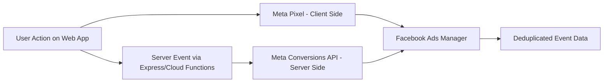
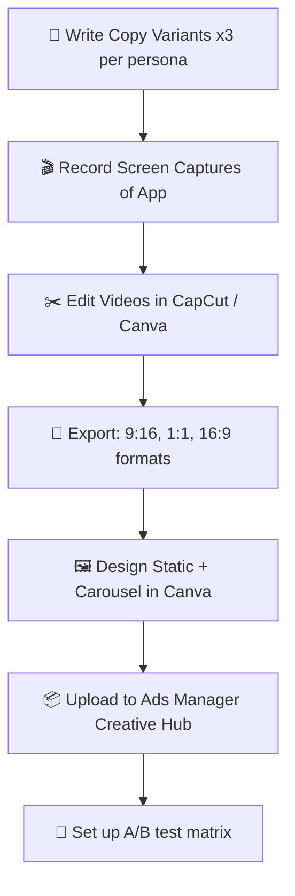
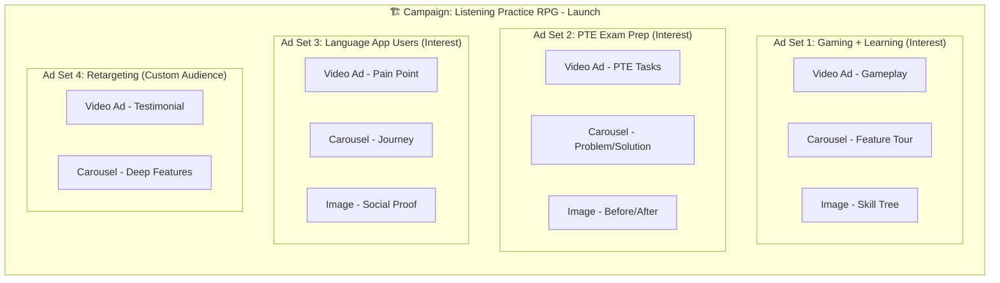
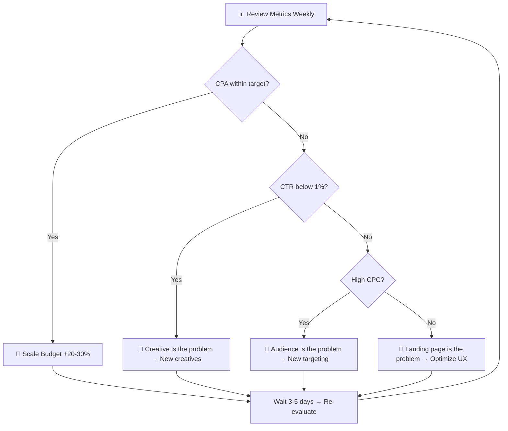
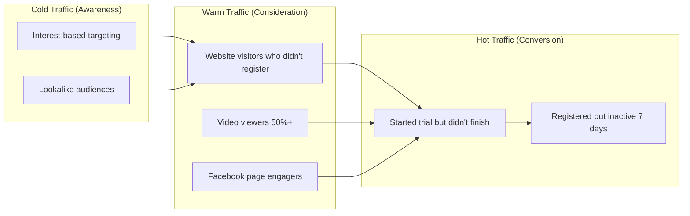

# 🚀 Facebook Advertising Launch Plan

## Listening Practice RPG — Gamified Language Learning

> **Objective:** Launch and scale a high-performing Facebook ad campaign to drive sign-ups and active users for our gamified language learning web app.
> **Date:** 2026-03-02 | **Version:** 1.0 | **Status:** Draft for Review

---

## 📋 Table of Contents

1. [Executive Summary](#-executive-summary)
2. [Phase 0: Pre-Flight Checklist](#-phase-0-pre-flight-checklist-days-1-3)
3. [Phase 1: Technical Infrastructure & Tracking](#-phase-1-technical-infrastructure--tracking-days-4-7)
4. [Phase 2: Audience Research & Targeting](#-phase-2-audience-research--targeting-days-8-12)
5. [Phase 3: Creative & Copy Strategy](#-phase-3-creative--copy-strategy-days-13-20)
6. [Phase 4: Campaign Structure & Budgeting](#-phase-4-campaign-structure--budgeting-days-21-23)
7. [Phase 5: Launch & The Learning Phase](#-phase-5-launch--the-learning-phase-days-24-30)
8. [Phase 6: Optimization & Scaling](#-phase-6-optimization--scaling-day-31)
9. [Appendix: KPI Dashboard & Glossary](#-appendix-kpi-dashboard--glossary)

---

## 🎯 Executive Summary

Our product is a **gamified language learning RPG** that merges rigorous study tools (SRS, dictation, pronunciation analysis) with engaging gameplay loops (RPG skill trees, Survival Mode).

**Our unique selling propositions (USPs) for Facebook ads:**

| USP | Hook Angle | Target Emotion |
| --- | --- | --- |
| 🎮 **RPG Skill Trees** | "Level up your English like leveling up a character" | Excitement, curiosity |
| ⚔️ **Survival Mode** | "Play a game that secretly teaches you vocabulary" | Fun, novelty |
| 📈 **Real Proficiency Tracking** | "See your CEFR level grow in real-time" | Achievement, trust |
| 🗣️ **Pronunciation AI** | "Get pronunciation feedback no teacher can give" | Confidence, relief |
| 🆓 **Try Without Signing Up** | "Jump in and practice in 10 seconds. No account needed." | Low friction, curiosity |

> [!IMPORTANT]
> **Primary Audience:** Vietnamese learners preparing for PTE Academic (A2 level and above) who are gamers or tech-savvy. **Secondary Audience:** Global language learners who are frustrated with boring study tools.

---

## 🔧 Phase 0: Pre-Flight Checklist (Days 1-3)

> *Before touching Facebook, ensure the product is conversion-ready.*

### ✅ Landing Page Optimization

- [ ] **Hero section maps directly to user pain points:**
  - PTE students → "Master WFD, RS, RL tasks — while playing a game"
  - Gamers → "Your English is your character. Level up."
- [ ] **Demo entry works without auth:** Verify `?demo=1` flow reaches first practice within 10 seconds
- [ ] **Social proof visible above the fold:**
  - Student testimonials (even beta users)
  - Star rating or "Trusted by X learners" badge
  - Screenshot of the RPG Skill Tree in action
- [ ] **CTA is clear and low-friction:**
  - Primary: **"Play Now — Free"** (routes to demo)
  - Secondary: **"Sign Up"** (for lead capture)
- [ ] **Mobile responsiveness verified:** 98%+ of Facebook users are on mobile
- [ ] **Page load speed < 3 seconds** on mobile (use Lighthouse audit)

### ✅ Business Infrastructure

- [ ] Create or verify **Facebook Business Manager** account
- [ ] Link your **Facebook Page** (create one if needed, with branded cover/profile)
- [ ] Add **payment method** to Ads Manager
- [ ] Set up **Facebook Ad Account** (separate from personal)
- [ ] Verify **business domain** in Business Settings → Brand Safety → Domains

> [!TIP]
> **Quick Win:** Before launching paid ads, post 5-10 organic posts on your Facebook Page to establish credibility. Include short gameplay clips, student success stories, and behind-the-scenes development posts.

---

## 📊 Phase 1: Technical Infrastructure & Tracking (Days 4-7)

> *Flawless tracking = flawless optimization. If you can't measure it, you can't improve it.*

### Step 1.1: Install the Meta Pixel

```text
Where: Facebook Events Manager → Data Sources → Add Pixel
Method: Google Tag Manager (recommended) OR direct code injection
```

**Standard Events to configure for our app:**

| Event Name | Trigger | Purpose |
| --- | --- | --- |
| `PageView` | Every page load | Baseline traffic tracking |
| `ViewContent` | User views a practice mode page | Interest signal |
| `CompleteRegistration` | User creates an account | Lead capture |
| `StartTrial` | User begins first practice session | Activation signal |
| `Purchase` | User upgrades to premium (if applicable) | Revenue tracking |
| `Lead` | User submits email / contact form | Lead gen campaigns |

**Implementation checklist:**

- [ ] Place base Pixel code in `<head>` of `index.html`
- [ ] Configure standard events via GTM or inline `fbq('track', 'EventName')` calls
- [ ] Verify pixel fires correctly using **Meta Pixel Helper** Chrome extension
- [ ] Test each event in **Facebook Events Manager → Test Events**

### Step 1.2: Implement Conversions API (CAPI)

> [!WARNING]
> **Client-side pixel alone can miss 20-30% of conversions** due to ad blockers, iOS 14+ App Tracking Transparency, and browser privacy features. CAPI is mandatory.

**Technical approach for our stack:**



- [ ] Set up server-side event sending using the **Meta Business SDK** (Node.js)
- [ ] Send events from Cloud Functions (e.g., `submitAttempt`, `completeRegistration`)
- [ ] Match user data parameters: `em` (hashed email), `ph` (hashed phone), `external_id`, `fbp`, `fbc` cookies

### Step 1.3: Event Deduplication

Since we run **both** Pixel and CAPI, we must prevent double-counting:

- [ ] Generate a **unique `event_id`** (UUID) for each user action
- [ ] Pass the same `event_id` in both the client-side `fbq()` call and the server-side CAPI request
- [ ] Verify deduplication in **Events Manager → Overview → Deduplication tab**

### Step 1.4: Aggregated Event Measurement (AEM) Setup

- [ ] **Verify your domain** in Business Manager
- [ ] Configure **up to 8 prioritized events** in Events Manager:
  1. `Purchase` (highest priority)
  2. `CompleteRegistration`
  3. `StartTrial`
  4. `Lead`
  5. `ViewContent`
  6. `PageView`
  7. *(reserve)*
  8. *(reserve)*

---

## 🎯 Phase 2: Audience Research & Targeting (Days 8-12)

### Step 2.1: Define Buyer Personas

````carousel
### 🎮 Persona 1: "The Gamer Learner"
**Demographics:** 18-30, male-skewing, Vietnam & SEA
**Interests:** Gaming, RPGs, anime, tech
**Pain Points:**
- "Traditional learning apps are boring"
- "I spend hours gaming but feel guilty I'm not studying"
- "I want to learn but can't stay motivated"

**Hook:** "What if gaming WAS studying?"
**CTA:** "Play Now — Level Up Your English"
<!-- slide -->
### 📚 Persona 2: "The PTE Warrior"
**Demographics:** 20-35, gender balanced, Vietnam
**Interests:** PTE Academic, IELTS, study abroad, immigration
**Pain Points:**
- "PTE practice is monotonous and expensive"
- "I can't get enough practice with real exam-style tasks"
- "I need a higher score to get my visa"

**Hook:** "Practice PTE tasks that feel like a game — free"
**CTA:** "Start Practicing — Free"
<!-- slide -->
### 🌍 Persona 3: "The Global Self-Learner"
**Demographics:** 18-40, global, tech-savvy
**Interests:** Language learning, Duolingo, self-improvement
**Pain Points:**
- "Duolingo is too basic for intermediate learners"
- "I need real pronunciation feedback, not just multiple choice"
- "I want to track my actual progress, not just streaks"

**Hook:** "Beyond Duolingo: Real proficiency, real feedback, real fun"
**CTA:** "Try It Now — No Sign-up Required"
````

### Step 2.2: Competitor Research via Facebook Ad Library

- [ ] Go to **[facebook.com/ads/library](https://www.facebook.com/ads/library)** and search:
  - `ELSA Speak` — Observe their ad angles, hooks, and creative formats
  - `Duolingo` — Study their viral/engagement-driven approach
  - `PTE Study` / `PTE Magic` — See what EdTech competitors in the PTE space are running
  - `Lingoda` / `Busuu` — Broader language learning ad strategies
- [ ] Document:
  - **Long-running ads** (these are profitable — learn from them)
  - **Ad formats used** (video, carousel, image)
  - **Copy hooks** (pain point vs. benefit-led)
  - **CTA types** (Sign Up, Learn More, Download)

### Step 2.3: Build Audience Targeting Clusters

> [!TIP]
> Don't stuff 50 random interests into one ad set. Create **focused clusters** of 5-15 related interests per ad set.

| Cluster Name | Interests to Include | Persona |
| --- | --- | --- |
| 🎮 **Gaming + Learning** | RPG games, League of Legends, Genshin Impact, Language learning | Gamer Learner |
| 📝 **PTE Exam Prep** | PTE Academic, IELTS, Study abroad, English learning | PTE Warrior |
| 📱 **Language App Users** | Duolingo, ELSA Speak, Babbel, Rosetta Stone | Global Self-Learner |
| 🇻🇳 **Vietnam Specific** | Vietnam education, Vietnam universities, TOEIC, English centers | PTE Warrior (VN) |
| 💻 **Tech-Savvy Learners** | Technology, Startups, Self-improvement, Online learning | All Personas |

### Step 2.4: Warm Traffic & Lookalike Audiences

**Build these audiences (even before launching ads):**

- [ ] **Website Visitors (180 days):** Anyone who visited your app
- [ ] **Engaged Users:** People who completed at least one practice session (`StartTrial` event)
- [ ] **Registration List:** Upload hashed email list of existing users
- [ ] **Facebook Page Engagers:** People who liked/commented/shared your posts

**Lookalike Audiences to create:**

| Source Audience | Lookalike % | Expected Size |
| --- | --- | --- |
| Existing active users | 1% | Highest quality, smallest |
| Registered users | 1-2% | Good balance |
| All website visitors | 2-3% | Broadest reach, lower intent |

---

## 🎨 Phase 3: Creative & Copy Strategy (Days 13-20)

> *Your ad creatives are the single biggest lever for success. They must stop the scroll.*

### Step 3.1: Creative Formats to Produce

#### 🎬 Format A: Video Ads (15-60 seconds) — **Highest Priority**

> **Rule:** Hook within 3 seconds. Captions ON (80%+ watch with sound off).

**Video concepts for our app:**

| Video # | Concept | Hook (First 3 Seconds) | Duration |
| --- | --- | --- | --- |
| V1 | **Gameplay Showcase** | "What if studying English felt like THIS?" *(cut to Survival Mode action)* | 30s |
| V2 | **Before/After** | "I went from A2 to B1 in 3 months..." *(real or simulated student journey)* | 45s |
| V3 | **Feature Tour** | "This app has a SKILL TREE for learning English" *(RPG skill tree reveal)* | 30s |
| V4 | **PTE Specific** | "Free PTE practice that feels like a game" *(show WFD, RS tasks in-app)* | 30s |
| V5 | **Pain Point** | "Tired of boring vocabulary flashcards?" *(contrast with our SRS + RPG system)* | 15s |

**Video production checklist:**

- [ ] Screen-record actual app gameplay (Survival Mode is most visually engaging)
- [ ] Add animated captions (use CapCut or Canva)
- [ ] Use upbeat background music (royalty-free)
- [ ] End with clear CTA overlay: "Play Now — Free" + URL
- [ ] Export in **9:16 (vertical)** for Stories/Reels AND **1:1 (square)** for Feed

#### 🎠 Format B: Carousel Ads — **High Priority**

**Carousel concepts:**

| Carousel # | Theme | Cards (4-5 swipes) |
| --- | --- | --- |
| C1 | **Feature Tour** | Card 1: "Type Mode — Dictation" → Card 2: "Speak Mode — Pronunciation AI" → Card 3: "Survive Mode — Action Game" → Card 4: "Skill Tree — RPG Progression" → Card 5: CTA |
| C2 | **Journey** | Card 1: "Start as a Level 1 Learner" → Card 2: "Earn XP with every practice" → Card 3: "Unlock skills and power-ups" → Card 4: "Watch your CEFR level grow" → Card 5: CTA |
| C3 | **Problem/Solution** | Card 1: "Boring flashcards? 😴" → Card 2: "Expensive tutors? 💸" → Card 3: "No feedback? 🤷" → Card 4: "We built something different." → Card 5: CTA |

#### 🖼️ Format C: Static Image Ads — **Supporting**

- [ ] High-contrast screenshots of the Skill Tree (Fantasy RPG aesthetic)
- [ ] Before/after proficiency charts
- [ ] Social proof overlays (star ratings, testimonials)
- [ ] **Text rule:** Keep on-image text below 20% of the image area

### Step 3.2: Ad Copy Templates

> **Formula:** Pain Point → Solution → Social Proof → CTA

**Copy Template 1 — The Gamer Hook:**

```markdown
🎮 What if learning English felt like playing an RPG?

Level up your vocabulary. Unlock skills. Survive the boss fights.

Our app turns real English practice into a game you actually WANT to play:
→ 🗣️ AI Pronunciation Feedback
→ ⚔️ Vampire-Survivors-Style Vocabulary Game  
→ 🌳 RPG Skill Tree for Your English

🆓 Try it now — no sign-up required.
👉 [Play Now]
```

**Copy Template 2 — The PTE Warrior:**

```markdown
📝 Preparing for PTE Academic?

Practice WFD, RS, and RL tasks for FREE — but with a twist:
You earn XP, unlock skills, and level up like an RPG character.

✅ Adaptive difficulty that matches YOUR level
✅ Real-time pronunciation analysis
✅ Spaced repetition that actually works

Join 500+ learners who made PTE prep fun.
👉 [Start Practicing — Free]
```

**Copy Template 3 — The Pain Point:**

```markdown
😴 Bored of Duolingo?

Same. That's why we built something for REAL learners:

❌ No more baby sentences
❌ No more endless streaks with no progress
✅ Real dictation, real pronunciation feedback, real proficiency tracking

It's free. No sign-up. Just practice.
👉 [Try Now]
```

### Step 3.3: Creative Production Pipeline



**Minimum creative set for launch:**

- [ ] 3 video ads (V1, V3, V4 from above)
- [ ] 2 carousel ads (C1, C3 from above)
- [ ] 3 static image ads
- [ ] 3 copy variants per ad (= **total ~24 ad combinations** to test)

---

## 💰 Phase 4: Campaign Structure & Budgeting (Days 21-23)

### Step 4.1: Campaign Architecture



### Step 4.2: Budget Calculation

> **The 50-Conversion Rule:** Meta's algorithm needs ~50 conversions per ad set per week to exit the Learning Phase.

**Budget math:**

| Scenario | Target CPA | Daily Budget per Ad Set | Weekly Budget per Ad Set | Total Daily (4 Ad Sets) |
| --- | --- | --- | --- | --- |
| **Conservative** | $5 CPA (Registration) | ($5 × 50) ÷ 7 = **$36/day** | $250/week | **$144/day** |
| **Moderate** | $3 CPA (Registration) | ($3 × 50) ÷ 7 = **$22/day** | $150/week | **$88/day** |
| **Aggressive** | $2 CPA (Registration) | ($2 × 50) ÷ 7 = **$15/day** | $100/week | **$60/day** |

> [!IMPORTANT]
> **Recommendation:** Start with the **Moderate** scenario ($88/day ≈ $2,640/month). If budget is tight, start with just 2 ad sets ($44/day ≈ $1,320/month) and optimize for `CompleteRegistration` as your conversion event.

### Step 4.3: Conversion Event Selection

**If budget is limited**, optimize for an event **higher in the funnel** that occurs more frequently:

```text
                    ┌──────────┐
                    │ Purchase │ ← Fewest events (optimize only if high budget)
                    ├──────────┤
                  │ StartTrial │ ← Moderate frequency
                  ├────────────┤
              │CompleteRegistration│ ← ⭐ Recommended starting event
              ├─────────────────────┤
           │       ViewContent       │ ← High frequency but low intent
           ├──────────────────────────┤
        │          PageView            │ ← Too high-funnel for optimization
        └──────────────────────────────┘
```

### Step 4.4: Campaign Settings Checklist

- [ ] **Objective:** Conversions (optimize for `CompleteRegistration`)
- [ ] **Advantage Campaign Budget (CBO):** ON — let Meta auto-allocate budget to best ad sets
- [ ] **Attribution Window:** 7-day click, 1-day view (default — good for web apps)
- [ ] **Placement:** Automatic (let Meta decide between Feed, Stories, Reels, etc.)
- [ ] **Schedule:** Run continuously (no end date initially)
- [ ] **Bid Strategy:** Lowest cost (default — best for learning phase)

---

## 🛫 Phase 5: Launch & The Learning Phase (Days 24-30)

### The 7-Day Hands-Off Protocol

> [!CAUTION]
> **DO NOT** make significant edits during the first 7 days. Doing so resets the Learning Phase and spikes costs.

**What counts as a "significant edit" (avoid these):**

| ❌ Don't Do This | ✅ Okay to Do |
| --- | --- |
| Change budget by more than 20% | Check metrics daily |
| Swap or pause creatives | Take notes on performance |
| Change audience targeting | Plan next creative batch |
| Change optimization event | Monitor for policy violations |
| Change bid strategy | Prepare lookalike audiences |

### Daily Learning Phase Monitoring

```text
Day 1-3: 📊 Check "Delivery" column in Ads Manager
         → Status should say "Learning"
         → If "Learning Limited" → audience too narrow or budget too low

Day 4-5: 📈 Start reviewing early performance signals
         → Which ad set has the lowest CPA?
         → Which creative has the highest CTR?

Day 6-7: 🎯 Prepare optimization plan for Day 8
         → Identify winning creatives
         → Identify underperforming ad sets
         → Draft new creative concepts based on winners
```

### Day 7 Checkpoint — Go/No-Go Decision

| Metric | 🟢 Good | 🟡 Okay | 🔴 Needs Work |
| --- | --- | --- | --- |
| **CTR (Link)** | > 2% | 1-2% | < 1% |
| **CPA** | Below target | At target | 2x+ target |
| **Frequency** | < 2.0 | 2.0-3.0 | > 3.0 |
| **Delivery** | Active | Learning | Learning Limited |

---

## 📈 Phase 6: Optimization & Scaling (Day 31+)

### Step 6.1: The Optimization Cycle



### Step 6.2: Key Metrics Dashboard

| Metric | What It Tells You | Action If Bad |
| --- | --- | --- |
| **CTR (Click-Through Rate)** | Is the creative compelling? | Refresh creatives |
| **CPC (Cost Per Click)** | Is the audience expensive? | Broaden or change targeting |
| **CPA (Cost Per Action)** | How much does a sign-up cost? | Optimize funnel or budget |
| **ROAS (Return on Ad Spend)** | Are you making money? | Scale winners, kill losers |
| **Frequency** | How often does one person see the ad? | Rotate creatives if > 3.0 |
| **Relevance Score** | Does Facebook think the ad is good? | Improve targeting + creative |

### Step 6.3: Creative Refresh Strategy

> **Rule:** Always have 2-3 new creatives ready to deploy before existing ones fatigue.

**Creative refresh cadence:**

| Week | Action |
| --- | --- |
| Week 1-2 | Launch initial creative set (8-12 ads) |
| Week 3 | Analyze winners → Create 3-4 new variations of winners |
| Week 4 | Pause underperformers → Launch new variations |
| Week 5-6 | Introduce entirely new creative concepts |
| Monthly | Full creative audit → Retire fatigued assets |

### Step 6.4: Retargeting Funnel



**Retargeting ad strategy:**

| Audience | Message | CTA |
| --- | --- | --- |
| Visited but didn't register | "Ready to level up? Your RPG adventure awaits." | "Sign Up — Free" |
| Watched 50%+ of video ad | "You liked what you saw. Try it now." | "Play Now" |
| Registered but inactive | "Your character is waiting. Come back and practice!" | "Continue Playing" |

### Step 6.5: Scaling Playbook

| Scale Strategy | When to Use | How |
| --- | --- | --- |
| **Vertical Scaling** | Winning ad set, stable CPA | Increase budget by 20-30% every 3-5 days |
| **Horizontal Scaling** | Want to reach new audiences | Duplicate winning ad set → new interest cluster |
| **Lookalike Scaling** | Have 100+ conversions | Create 1%, 2%, 3% lookalikes → test each |
| **Geographic Scaling** | Winning in VN, ready to expand | Test same creatives in Philippines, Thailand, Indonesia |
| **Creative Scaling** | Winners identified | Make 5-10 variations of winning creative (hooks, CTAs, formats) |

> [!WARNING]
> **Never increase budget by more than 30% at once.** This shocks the algorithm and resets the learning phase. Slow and steady wins the scale.

---

## 🌱 Bonus: Organic Growth Strategy (Parallel Track)

> *Paid ads are fuel. Organic content is a flywheel.*

### Facebook Group Strategy

- [ ] Create a group: **"English RPG Learning Community"** or similar
- [ ] Post daily challenges: "Can you type this sentence correctly in under 10 seconds?"
- [ ] Share student progress screenshots (with permission)
- [ ] Run weekly "Survival Mode Leaderboard" competitions
- [ ] Use the group for product feedback and feature requests

### Content Calendar (Organic Posts)

| Day | Content Type | Example |
| --- | --- | --- |
| Monday | **Motivation** | "Your Week 1 → Week 4 progress could look like this" (chart graphic) |
| Tuesday | **Feature Spotlight** | "Did you know you can practice pronunciation with AI?" (screen recording) |
| Wednesday | **Challenge** | "Can you spell all 5 words correctly? Drop your score below ⬇️" |
| Thursday | **Student Story** | "Meet Linh — she improved her PTE speaking from 45 to 65" |
| Friday | **Fun/Meme** | Gaming meme adapted for language learning (Duolingo owl parody?) |
| Weekend | **Gameplay Clip** | 30-second Survival Mode highlight reel |

### Viral Content Ideas (Duolingo-Inspired)

- "What your English level says about you" → entertaining tier list video
- "POV: You've been grinding vocabulary for 7 days straight" → relatable gaming humor
- Student unboxing their "Level 10 Certificate" (digital milestone screenshot)
- "Boss Fight" compilation of hardest vocabulary words

---

## 📊 Appendix: KPI Dashboard & Glossary

### Target KPIs for Month 1

| Metric | Target | Notes |
| --- | --- | --- |
| **Impressions** | 100,000+ | Broad reach for brand awareness |
| **CTR** | > 1.5% | Industry average for EdTech is 1.0% |
| **CPC** | < $0.50 | For Vietnam market; higher for global |
| **CPA (Registration)** | < $3.00 | Primary success metric |
| **CPA (StartTrial)** | < $5.00 | Deeper funnel metric |
| **Frequency** | < 2.5 | Keep ads fresh |
| **Registrations** | 500-1,000 | Volume target |

### Glossary

| Term | Definition |
| --- | --- |
| **CPA** | Cost Per Action/Acquisition — how much you pay per conversion |
| **CTR** | Click-Through Rate — % of people who click after seeing your ad |
| **CPC** | Cost Per Click — how much each click costs |
| **ROAS** | Return on Ad Spend — revenue generated per dollar spent |
| **CPM** | Cost Per Mille — cost per 1,000 impressions |
| **CBO** | Campaign Budget Optimization — Meta auto-allocates budget |
| **CAPI** | Conversions API — server-side tracking |
| **Frequency** | Average number of times one person sees your ad |
| **Learning Phase** | Initial period where Meta's algorithm is optimizing delivery |
| **Lookalike** | Audience that mirrors your existing users' demographics/behavior |

---

### 📝 Skills & Resources Used

| Skill | How It Was Applied |
| --- | --- |
| `content-marketer` | Social media strategy, ad copy templates, content calendar |
| `sales-automator` | Copy frameworks (pain point → solution → CTA), A/B test structure |
| `affiliate-master` | Social media monetization patterns, compliance awareness |
| `seo-content-writer` | Landing page optimization, keyword alignment for ad copy |
| `market-sizing-analysis` | Budget scenario modeling, audience sizing |
| `competitive-landscape` | Facebook Ad Library competitor research framework |

---

> **Next Steps:** Review this plan → Approve → Begin Phase 0 execution.
> **Estimated time to first ad live:** 24-30 days from approval.
