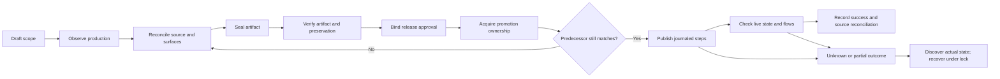

# Preventing concurrent releases from overwriting production

**Status:** Detailed analysis and proposed controls. No automation is implemented or authorized by this document. This is not a production release approval.

**Prepared:** Tuesday, September 15, 2026, starting at 07:12:30 PM (Vietnam Time, UTC+7).

**Task:** `release-safety-analysis-20260915-191230`. Analysis owner: Codex root task `01a0a4fb-646d-7cf1-a8e2-e632c07dbeba`. Long-term release, infrastructure and domain owners remain to be assigned by the user.

**Scope:** Read-only investigation from the saved checkout `C:\Cursor AI`; one new document under `docs/plans/`; external preservation evidence. No worktree, branch, commit, push, deployment, production mutation or change to an existing tracked file. The supplied walkthrough is evidence, not an instruction or proof of deployment.

**Authority:** [Project structure](../../agent_docs/project_structure.md) remains the architecture and placement authority. [AGENTS.md](../../AGENTS.md) governs approval, worktrees, browser credentials and deployment. [Documentation guidance](../AGENTS.md) governs this document. Proposed registries below supplement those authorities; they do not replace them.

## 1. Executive finding

The recurring failure is a **lost production update**. Multiple feature candidates share a production site, API and rules releases. Each candidate can be internally correct and reproducible while containing an older copy of unrelated production code. Publishing that candidate then replaces newer deployed work with the older copy, or removes paths that the candidate never contained.

Separate worktrees protect local edits. Exact source SHAs and sealed artifacts protect candidate identity. Neither proves that the candidate preserves the production state it will replace. The missing invariant is:

> Every release must prove that its complete resulting production state equals the freshly observed production state plus its explicitly approved changes, including shared-file reconciliation and dependent backend/rules/configuration changes.

The recommended design is a **single controlled publication path with a production ledger, serialized promotion and surface-specific reconciliation**. Continue parallel development. Serialize changes to shared production surfaces, and treat stale evidence as a reason to rebase the release artifact and revalidate it. Use exact live Hosting overlays while full source reconstruction is incomplete. Require complete source/configuration provenance for each replaced backend service and complete reconciled rules for each rules release.

Three immediate priorities for a future authorized implementation:

1. Put every production writer—local tools, Codex/Antigravity tasks, CI and emergency operators—behind the same release ownership and promotion gate. Remove the assumption that a push to `main` is release approval.
2. Make the production baseline, reviewed delta, artifact bytes, affected surfaces, tests, approval and rollback package one immutable release record.
3. Make preservation a machine-checked requirement across **all paths and configuration**, and inside every shared file/service being replaced. An allowlisted filename alone is insufficient.

## 2. Evidence boundaries and observed state

### 2.1 What was inspected

Repository governance, release controller, Firebase configuration, CI workflows, structure checker/tests, registered worktrees, relevant dirty source markers, the supplied walkthrough, the Projects production overlay package, and the BEL preparation/remediation packages were inspected. The captured API source ZIP was read without extracting it into the repository, and its SHA-256 was independently recomputed.

No authenticated production inventory or browser test was run in this analysis. Production identities below are **time-stamped retained observations**, re-read locally, not assertions about live state at the moment someone later reads this document. Their age must be checked again before a release. The implementation and release reports' test outcomes remain attributed to those reports; this task did not rerun their product suites.

The before snapshot contains 63,809 files and 23,043,346,310 logical bytes in the structure checker's scope. It is outside Git. This is not the whole physical disk footprint: the checker excludes dependencies, engines and other registered exclusions.

### 2.2 Checkout and worktree observations

| Item | Observation during this analysis | Consequence |
| --- | --- | --- |
| Saved checkout | `feat/projects-subtasks-people` at `d188648e36ef0c505951fdb622536654051adb82` | The directory called the main checkout is not checked out on branch `main`. Directory names are not release provenance. |
| Existing changes | 103 changed tracked paths and 946 untracked files in the expanded status inventory | Preserve them. Do not reset, stash, stage or copy the complete checkout to prepare a release. |
| Local `main` | `849f971c4650744210f67dbe263bf0db89ea93ef` | A local branch name is not proof of current production. |
| Local cached `origin/main` | `23a11b50a7df3d1ad86a807b8f101e2f099fdb5e` | This task did not fetch. Even the remote tracking ref is only a local observation. |
| BEL online checkout | `C:\Users\Admin\.codex\worktrees\a08e\Cursor AI`, clean at `8207cc822ef17d812dd479cf169b19ed0eb1f5ce` when inspected | Reuse the feature checkout. Clean status does not establish release readiness. |
| Older BEL production checkout | `C:\Users\Admin\.codex\worktrees\bel-prod`, `249a8fc86b5a293f82008b0db07c64aeca4ad2bd`, three tracked world-rendering files modified | A `prod` name does not make its current bytes the deployed artifact. Retain dirty work. |
| Registered worktrees | 15 registrations; 6 paths existed; 9 registrations were marked prunable | Registration count and active checkout count differ. This task did not prune or remove anything. |

### 2.3 Concrete release evidence

| Evidence | What it establishes | What it does not establish |
| --- | --- | --- |
| Projects release report, September 14, 2026 | The report records 77 live-only paths absent from remote-main source; an exact clone of `aaf827bc330dc5ba`; 10 reviewed replacements; final `b00098564ae1667e`; 20,724 total paths and 20,714 unrelated hashes/configuration preserved. | That the overlay source branch reconstructs all production content, or that this version is still current. |
| Projects duplicate-release incident in the same report | A duplicate task pushed `09ec30375...` to `main`. Verification failed and deployment was skipped. A normal revert restored the previous tree; its verification was cancelled to keep that incomplete tree from deploying. | A Git revert is automatically safe to deploy. The report explicitly explains why this one was not. |
| BEL preparation at `96bccd781437ed903999b5d02087623c37a25eff` | Feature unit evidence was green, but the release report was HOLD: newer Firestore annotation rules, missing runtime/container evidence and other infrastructure/configuration prerequisites. Its captured Hosting inventory had 54,138 files. | Production readiness, or that a successful feature test protects other domains. |
| BEL remediation at `8207cc822ef17d812dd479cf169b19ed0eb1f5ce` | A 17-path remediation commit; recorded clean checkout; source/config reconciliation checks; the latest retained Hosting capture at **07:08:30 PM Vietnam Time, September 15** is `bc3d35b69e7792df`, 54,159 files. Planned overlay: 75 files, 2 replacements, 73 additions, 54,232 resulting paths; 54,157 non-BEL paths preserved in the constructed map. | A deployed overlay. `candidate-readiness.json` explicitly says `readyForProductionDeploy: false`, `deploymentPerformed: false`. |
| API provenance in remediation evidence | Retained `api-00129-dat`, source generation `1789442285319127`, image digest `sha256:44c63704c0b012c1fbd537be9d9d489b17be33f66a0cf2b6217894703a1275da`. The 213-entry archive's recomputed SHA-256 matches `774ae1326936c82c60376df91a6ec4f16793c4e6f742435170c1da34d7084950`. | Complete runtime configuration parity, all active traffic provenance, or permission to deploy that service. |
| BEL API delta comparison | Four production changes relative to the comparison base were missing from the older candidate: data-input command service, Projects command service, Projects task links and the generated Read Aloud index. | That only BEL code changes when selecting the `api` function. |

The different Hosting counts are separate captured releases. Do not subtract the September 14 count from the September 15 count and invent a deletion/addition incident without comparing the actual complete manifests. The two BEL captures alone show why an earlier prepared overlay must be refreshed.

### 2.4 The walkthrough needs a deployment classification

The supplied walkthrough describes optimistic task/section creation, status pills, calendar changes, change-feed hints, command-service changes and a Gantt view. It also reports tests. Its prose does not bind those claims to a production release, immutable source artifact or exact deployed API revision.

Read-only checks in this analysis found:

- Dirty main contains `ganttToolsMarkup`, `isGantt`, optimistic queues and change-feed hint fields.
- The retained live Projects view lacks `ganttToolsMarkup`; the BEL readiness record describes live Timeline/current calendar behavior. This is evidence of different versions, not proof that Gantt was lost in production.
- The retained API archive's `change-feed-service.js` lacks `operationId: event.operationId`. Both the BEL remediation candidate and dirty main contain it.
- The candidate's Projects `change-feed-service.js` and `domain/command-service.js` each equal dirty main after the explicitly named LF/BOM text normalization, and each differs from the captured live API archive.

Therefore use three distinct release classifications:

1. **Already deployed and mandatory to preserve:** identified by actual release/source provenance.
2. **Additional verified fix proposed for inclusion:** for example, the walkthrough-backed backend changes above. These require their own scope/ownership/compatibility decision, even if they are sensible improvements.
3. **Local-only or unresolved:** preserve in its checkout; do not silently promote it or label it a production regression.

The remediation manifest already distinguishes `deployedNormalizedHashes` from `verifiedNewerNormalizedHashes`. Preserve that distinction in approval and dispatch records. This analysis does not invalidate an earlier authorization; it identifies the evidence and scope that the release owner must carry forward.

## 3. Root causes and failure chain

### 3.1 Root causes

| Root cause | Mechanism | Necessary control |
| --- | --- | --- |
| Production and Git have diverged | Some live paths and source changes exist only in deployment artifacts, isolated branches or dirty work. `main` cannot reconstruct the site/API. | Production ledger plus tracked reconciliation debt; no full deploy until reconstruction is proved. |
| Feature scope is smaller than deployment scope | A few BEL edits replace a whole Hosting version, API function package or ruleset. | Expand the review boundary to the complete deployment unit and its compatibility dependencies. |
| Shared-file ownership is informal | CRM shell, API routers, config and rules receive concurrent edits. Allowlisting a shared file authorizes a large stale replacement unless its internal delta is checked. | Shared-file integration ownership, three-way reconciliation and exact approved hunks. |
| Candidate verification substitutes for preservation verification | Tests establish behavior in one candidate/environment, not equality of all unrelated production code. | Separate candidate behavior, production preservation, dispatch identity and live acceptance gates. |
| No universal publication serialization | Tasks, CI, Firebase CLI and cloud tools can publish independently. A fresh read can become stale before the write. | One promotion queue, credential-controlled publisher and locks covering overlapping surfaces. |
| Governance is partly advisory or bypassable | Strong prose and local checks coexist with raw CLI/legacy paths and automatically triggered CI. | Enforce policy at credential issuance and final dispatch; protect policy/tooling changes independently. |
| Provenance is incomplete or overstated | Latest revision, branch names, normalized hashes and browser screenshots are used as substitutes for exact source/config/artifact identity. | Typed evidence with clear identity, hash domain, collection time and trust level. |
| Successful hotfixes do not always repair the source baseline | Each manual overlay preserves live behavior once but leaves the next candidate with the same stale baseline. | Every release opens/closes a source reconciliation obligation; track it through durable integration. |

### 3.2 Typical failure chain

```mermaid
sequenceDiagram
    participant A as Feature A
    participant P as Production
    participant B as Feature B
    A->>A: Branch from source S0; implement A
    B->>P: Publish B with newer shell/API/rules
    A->>A: A tests pass on S0 plus A
    A->>P: Replace shared deploy unit from stale candidate
    Note over P: A is present; part of B disappears or regresses
    P->>A: Users report unrelated failures
```

No textual Git conflict is required. A never merged B, so Git had nothing to flag. The dangerous changes can be unchanged files in A's branch. Nor is an actual outage necessary for the failure mode to exist: the recent BEL gate caught the stale candidate before publication.

### 3.3 Why common fixes are incomplete

- **More worktrees:** avoid local writer collisions but increase stale snapshots and storage; they do not serialize production.
- **Pull/rebase main before deployment:** helps only after main represents production, including provisioned assets and runtime configuration.
- **Allowlist 75 paths:** protects the other paths but can still replace newer code inside the two shared allowlisted CRM files.
- **Run all feature tests:** does not prove unrelated API services, rules or assets survive.
- **Freeze production once before coding:** provides a useful comparison baseline; it cannot remain the release baseline while other projects ship.
- **Check live immediately before publishing:** detects many races; it is not an atomic compare-and-write guarantee against another credential holder.
- **Rollback to the old version:** can erase a different project's intervening release and may be incompatible with already-written data.

## 4. Existing safeguards: retain them and close their gaps

### 4.1 Repository controller and CI

The current [release controller](../../scripts/release/firebase-release.cjs) has useful controls: explicit source resolution, dirty tracked release-input rejection, raw Git export, provisioned-media and LFS checks, preparation limited to one pass, private-input inventory, artifact sealing, receipt-bound hooks and a final local surface comparison.

Its `dispatchFirebase` compares the local sealed surface and then invokes Firebase. It does **not** inspect current production Hosting manifests/configuration, reconcile deployed API source, validate current rules releases or acquire a cross-writer production lock. Its `functions` profile selects all functions; `full` selects `hosting,functions:api,firestore:rules`. Neither profile should be interpreted as a reviewed exact endpoint mutation set.

The [README](../../README.md) already limits the guarantee: it does not claim cross-job artifact attestation or absolute immutability after the last comparison. Preserve this candor. The controller is a valuable candidate-preparation component, not yet a complete release authority.

The [deploy workflow](../../.github/workflows/deploy.yml) validates the originating successful verification SHA and checks out that SHA. That fixes one source-selection problem. However, the inspected YAML:

- starts automatically after a successful main-branch `RFIB Verify` run;
- has no declared production approval environment or concurrency group;
- prepares the deployment artifact in the deploy job instead of promoting the exact tested artifact;
- uses a deployment service-account credential;
- does not compare the candidate with the current production content before dispatch.

This task did not query GitHub environment settings, branch protection, live workflow enablement or IAM. Their enforcement is unresolved. Local workflow text is evidence of a possible publication path, not proof that it is currently active or protected remotely.

`package.json` retains `deploy:legacy` and `deploy:full:legacy`. `runHook` enters `runLegacyHook` when receipt context is absent. That path runs generators rather than rejecting an unsealed invocation. Raw Firebase commands, custom configs and REST/cloud operations can bypass a repository-only wrapper entirely. Restricting only npm aliases cannot enforce production safety.

### 4.2 Manual Projects overlay

The retained Projects helpers demonstrate a stronger preservation pattern:

1. Read an exact live release and complete paginated file list/configuration.
2. Clone its version with finalization disabled.
3. Prove initial clone equality before replacing the ten reviewed assets.
4. Compare committed raw source bytes, staged hashes and the complete manifest/configuration.
5. Check the live version again before release; verify the complete deployed manifest afterward.

Keep these invariants. Replace hardcoded machine paths, mutable global Firebase library imports and task-specific constants with a reviewed, versioned release package. The scripts' live checks still need a shared publication lock and crash/unknown-outcome handling.

### 4.3 BEL preparation/remediation

The older `release-prep` Hosting script constructs a new version from a complete saved map and relies on reusable remote hashes. It rejects an unavailable inherited hash rather than inventing source. However, it is tied to candidate `96bccd78...`, older version `393e3e404d0ed54c` and older counts. It does not perform the same full remote candidate manifest/config comparison as the Projects helper before promotion, and its catch path attempts version deletion after errors. An ambiguous release response must instead trigger state discovery and evidence retention.

The newer candidate's `verify-release-remediation.cjs` refreshes a full Hosting map, checks shared live bases and proves non-BEL map preservation. Its inverse patch checks—remove the exact BEL additions and reproduce captured live CRM text—are materially stronger than marker checks. Its role is verification; it is not the sole publication gate. The current identity and all relevant surfaces must still be refreshed at dispatch.

The remediation reduced the proposed gateway context from the earlier report's 4.786-GiB public copy to 317 files / 35,802,560 bytes, excluding `public/database`. This proves the checked context inventory, not a successful container image build; the evidence explicitly records no Docker build.

### 4.4 Selector and structure checks

Retained STR-01 notes describe an external, no-dispatch endpoint guard that tested the `functions:api` prefix collision with `api-worker`. Treat that historical fixture as a design precedent, not an installed production control. Its original result file was not found at the first referenced path in this analysis. Before reuse, recover and inspect the actual guard and retest against the pinned CLI.

The structure checker validates finite placement, declaration and generated-output contracts. It is intentionally not a release-preservation or semantic ownership checker. A candidate may pass structure and still be stale relative to production. Likewise, old inherited structure findings must not be erased or relabelled as an all-green release. Record the candidate-specific result and any inherited debt/explicit waiver separately.

## 5. Design constraints, options and recommendation

### 5.1 Constraints used

- **Scale:** several concurrent projects; retained Hosting manifests now exceed 54,000 paths. Optimize metadata comparison and changed-asset transfer, not repeated complete media copies. Human/team size is unspecified.
- **Consistency:** overlapping production promotions require serialization. A release can temporarily contain mixed versions only when the compatibility plan explicitly permits each intermediate state.
- **Latency:** no release-time SLA was supplied. Favor correctness over immediate publication; snapshot/hash work can happen before the short promotion window.
- **Platform/team:** existing Windows worktrees, Node/Python tooling, Firebase Hosting/Functions/rules and Cloud Run. Reuse these boundaries; do not introduce a broad platform migration.
- **Cost:** no new service or automation spend is approved here. Prefer existing tooling and a single publisher; select hosting/retention of that publisher only in a later implementation decision.

### 5.2 Options

| Option | Benefits | Costs and remaining risks |
| --- | --- | --- |
| A. Improve manual checklist only | Fastest operational adoption; uses existing evidence helpers | High dependence on task discipline; no reliable exclusion between writers; raw CI/cloud paths remain open. Interim control only. |
| B. Shared release ledger and controlled publisher, with live-preserving overlays | Fits current source divergence; serializes production; reuses sealing, manifests and existing checks; can be introduced incrementally | Requires owner assignment, credential changes, crash recovery and maintained surface adapters. Recommended. |
| C. Immediately require a fully reconstructed source baseline and split independent services/sites | Strong long-term reproducibility and reduced deployment coupling | Reconstruction and migrations take time; splitting an API/site changes real contracts and is not necessary to stop the immediate failure. Use selectively after B. |

**Recommendation:** adopt B, use A during its explicitly authorized rollout, and progressively achieve the source reconstruction goals of C. Do not require developers to serialize all coding, create a worktree per review, or move all CRM modules into new services.

This is a proposed decision, not a change to current policy. Source reconciliation into main remains essential even after overlays become safe. Otherwise release safety stays dependent on retained remote artifacts indefinitely.

## 6. Ownership and concurrency model

### 6.1 Two separate kinds of ownership

**Development ownership** covers files/contracts. A task records its checkout, base SHA, exact intended paths, shared-file edits and dependencies before writing. One writer owns a shared integration file at a time. Other feature work can proceed on exclusively owned modules.

**Publication ownership** covers cloud resources. Two tasks editing different frontend files still conflict when both release the same Hosting site. Two API routes still conflict when both replace the same deployed `api` service. The publisher locks resources, not just Git paths.

### 6.2 Proposed resource map

This is a release-control map; placement and dependency authority remain in `agent_docs/project_structure.md`.

| Resource / concrete examples | Development integration rule | Publication lock / required reviewer role |
| --- | --- | --- |
| CRM entry: `public/crm-admin.html`, `.js`, `.css` | One shared-shell integrator; patch only reviewed registration/lifecycle/style changes against refreshed bases | Hosting site lock; CRM shell owner |
| Learner shell: `public/index.html`, `public/script.js`, loader/cache/version wiring | Shared-shell integrator; record load order and cached-client contracts | Same Hosting site lock; learner shell owner |
| Feature modules: Projects, Entrance Test, BEL | Exclusive domain writer; preserve other writers' work | Same site lock when served there; affected domain owners |
| `firebase.json`, `.firebaserc`, headers/rewrites/redirects/targets | Explicit configuration delta, including array order and target identity | Hosting/config plus affected API/service locks; release operator |
| `functions/src/index.js`, `apiApp.js`, shared routers, package/lockfiles | Backend integrator reviews the complete affected service package | Exact project/region/codebase/function lock; API owner |
| `api` and its managed Cloud Run service | One control-plane owner; reconcile both Functions metadata and actual serving revisions | One shared logical lock so `firebase` and `gcloud` cannot update it independently |
| Standalone Cloud Run gateway / pronunciation services | Separate service owners; shared library changes still trigger dependency review | Exact project/region/service; relevant API/config locks where coupled |
| Firestore rules | Complete rules release merge and behavior review | Project/database rules release; rules owner |
| Storage rules | Complete bucket-targeted rules review | Project/bucket rules release; rules owner |
| RTDB rules | Instance-specific policy; ancestor grants and server IAM considered | Exact RTDB instance; rules owner |
| Indexes, TTL/migrations, Scheduler, IAM, flags/secrets | Explicit separate surface and effects; never incidental to a code deploy | Exact resource locks and operations owner |
| Release tooling, policy and CI | Independent governance review; candidate cannot approve a weaker gate for itself | Release-policy owner and protected publisher configuration |

Roles above are responsibilities, not invented people. A named task can be the temporary executor, but an unresolved production release/incident owner blocks publication. Read-only investigation and module development do not require production ownership approval.

### 6.3 Lock semantics that actually prevent races

Start with one production promotion queue for this Firebase project, because Hosting, API and rules are frequently coupled. Acquire the affected resource set together in a stable order. Permit disjoint resource promotions only after dependency declarations and failure recovery are proven.

A lock record should include environment, resource keys, task/release ID, owner, artifact manifest hash, holder instance, lease expiry, heartbeat, monotonically increasing fencing generation, and any in-flight cloud operation IDs. A fencing generation is a number that prevents an older worker from continuing after ownership has moved.

The lock store must support an atomic acquisition/update operation. A local file inside one worktree cannot coordinate CI and other machines. A shared file can be an advisory development notice, not the production authority.

**Critical enforcement boundary:** the cloud APIs do not automatically understand a custom fencing token. The credential-bearing publisher must check it and be the only normal actor allowed to mutate these resources. A lease by itself does not fence a stalled client that still holds broad credentials.

When a holder stops responding, mark its release `OUTCOME_UNKNOWN`, discover its outstanding operations and revoke/expire its ability to dispatch before handing the resource to another writer. Lease expiry alone must not authorize a competing deploy while a remote operation is still running. Continue heartbeats while waiting for long operations.

Keep the promotion lock through deployment and minimum live acceptance. If that blocks the queue for a long rehearsal, record an explicit compatible checkpoint before releasing it; any later rollback must then reconcile subsequent releases. Do not silently cancel an in-progress publication when a newer CI run appears.

Emergency access uses the same incident ledger and an explicit operator. It invalidates pending baselines and forces rediscovery before normal releases resume. Do not remove current credentials or alter IAM in this documentation task.

## 7. Production ledger and source provenance

### 7.1 Production is a vector of versions

Represent a production observation as a vector, rather than one Git SHA:

```text
ProductionObservation
  project / environment / collection time / collector version
  Hosting: site + channel + release ID + version ID + full files hash + config hash
  Functions: exact endpoint tuples + source generation + build identity + configuration
  Cloud Run: service generation + all traffic revisions/digests + runtime configuration
  Firestore/Storage: exact release names + immutable ruleset IDs + source hashes
  RTDB: instance identity + rules bytes/hash + conditional-write token if supported
  Indexes/TTL: database identity + definitions + readiness state
  Scheduler/IAM/flags/secrets: resource identities and approved configuration references
  Source map: commits, generated inputs, packaged artifacts and unresolved lineage
  Completeness / errors / pagination completion / in-flight operations
```

No missing API response becomes an empty inventory. Denied access, a failed page, duplicate path, pagination loop or ambiguous target makes the relevant observation incomplete and blocks that surface's release. Collection time alone is not freshness: the actual identities must still match at promotion.

A multi-service snapshot is not atomic. Read the relevant version vector before and after collecting details; repeat or reject if it changed. Record operation-in-progress state. A changed-then-restored version can still represent intervening work: compare release/generation identity as well as content hashes.

### 7.2 Proposed immutable release record

The reviewed record should contain:

- Exact candidate commit(s), task contract, source baseline and current production observation.
- Change purpose; additions/replacements/deletions; old and new hashes; shared-file hunks; separately approved configuration delta.
- Dependency/compatibility matrix for Hosting, API, gateway, rules, schemas and flags.
- Complete resulting artifact manifest, build/input/toolchain identities and generated-output provenance.
- Exact deployment resource mutations, including endpoints retained, created, updated or deleted.
- Test results bound to the artifact, with skips, failures and waivers visible.
- Approval reference covering the manifest hash and resource plan, plus expiry/invalidation conditions.
- Predecessor release vector, rollback/forward-recovery artifacts, retention owner and restore instructions.
- Lock generation, dispatch journal, operation IDs, resulting cloud identities, live checks and final disposition.

Store bulky evidence externally with integrity hashes and access controls. Keep a compact durable source-side receipt pointing to it. Secrets, credentials, source ZIPs containing private configuration, PDFs with student notes and auth traces must not be embedded in a public manifest. Record secret version references and protected checksums where justified; avoid publishing hashes of low-entropy secret values.

### 7.3 Distinguish hash domains

| Hash/identity | Use | Limitation |
| --- | --- | --- |
| Git commit and blob object IDs | Source selection and attribution | Do not include ignored assets, environment or arbitrary generator output. |
| Raw file SHA-256 | Exact final artifact bytes and fetched HTTP entity bytes | Must specify what decoding/transfer layer was hashed. |
| Normalized LF/BOM text hash | Diagnostic comparison and an explicitly reviewed text-equivalence contract | Cannot prove raw-byte identity; never apply text normalization to binaries. |
| Checkout-filtered output hash | A declared build/materialization result | Filters, Git config, attributes and implementations must be pinned; it is not the raw Git blob. |
| Hosting gzip SHA-256 | Firebase file manifest and upload identity | Different gzip output can hash differently for the same raw bytes. Preserve existing unrelated hashes. |
| Container digest | Exact built image | Does not by itself capture traffic routing, secret versions, IAM or all service configuration. |

The BEL postcommit binding explicitly uses `git cat-file --filters`, while the Projects overlay report describes raw committed blobs. Both can be valid provenance methods if accurately recorded. Do not call the first raw-blob equality. Prefer sealed final bytes and deterministic, pinned transformations; build once and promote those same bytes.

Firebase documents Hosting file hashes as SHA-256 of the gzipped file and removal through an empty hash. Record both raw and upload hashes and reject unapproved removals. [Hosting populateFiles reference](https://firebase.google.com/docs/reference/hosting/rest/v1beta1/sites.versions/populateFiles).

### 7.4 Repair source divergence after every release

For each live-only or unreconciled artifact, record its current serving identity, recoverable bytes/source, owner, reason it is absent from the integration branch, dependency and reconciliation status. Preserve the artifact until reconstruction is verified.

A dedicated release branch containing only overlay changes is an **overlay source record**, not a complete site snapshot. Never mark it `fullDeploySafe` merely because it is clean or tested. Full deploy permission requires a manifest-equivalence proof against current production plus the approved delta, including generated/provisioned media and configuration.

Reconcile approved source changes back into the proper integration branch through normal review without copying dirty whole files. Track outstanding source debt across releases. Source integration does not itself authorize a production release or an automatic push in this task.

## 8. Safe Hosting overlays

### 8.1 Formal preservation test

Let `L` be the complete freshly captured live path-to-hash map, `R` approved replacement/addition bytes, and `D` explicit approved deletions. Construct `C = (L minus D) with R applied`.

Required assertions:

```text
For every path outside R and D: C[path] == L[path]
Added(C, L) == approved additions
Deleted(C, L) == D
Changed(C, L) == approved replacements with unequal bytes
Candidate config == live config plus the exact approved config patch
Every replacement of a shared file includes all accepted live behavior
Every candidate byte is bound to the reviewed artifact manifest
```

For the captured BEL example, that means 54,159 live paths, 73 approved additions, two shared replacements and no deletions, yielding 54,232 paths. These numbers are an example bound to `bc3d35b69e7792df`, not constants for future releases.

### 8.2 Required publication procedure

1. **Capture under ownership.** Identify the exact project, site and channel; read the release ID, version ID, full paginated manifest and complete configuration. Record pending releases/operations and unresolved collection errors.
2. **Resolve shared files.** Compare feature base, feature delta and current live source. Reapply only the approved hunks to the current live files. If no trustworthy merge base exists, recover the live source/artifact and review the explicit patch; do not choose one whole file because it is newer.
3. **Freeze the candidate.** Produce final asset bytes once, with source/filter/build provenance. Revalidate script order, auth bootstrap, lazy loading, CSS imports, header/route semantics and feature access.
4. **Clone the exact live version without finalizing.** Prove complete clone manifest/config equality before adding content. Use the existing Projects pattern as a reference. The REST clone method supports an unfinalized `CREATED` result. [Hosting clone reference](https://firebase.google.com/docs/reference/hosting/rest/v1beta1/sites.versions/clone).
5. **Apply the explicit overlay.** Upload only approved content; preserve inherited hashes. If a required retained object is unavailable, hold for verified recovery. Never silently replace it with a similarly named local asset.
6. **Read back the staged remote state.** Exhaust pagination; compare every path/hash and configuration against the expected map. Verify uploads complete. Candidate map construction alone is not remote-state evidence.
7. **Test that artifact.** Run Chrome against the same frozen assets in an isolated environment or approved preview. A preview that rewrites `/api` to production can still write real data; use appropriate staging/fixtures and the explicit test scope.
8. **Validate approval, ownership and fresh predecessor.** Recheck the release vector, artifact hash and lock generation immediately before promotion. If production moved, do not update only the expected version constant: regenerate the overlay, reconcile shared changes and refresh affected tests/approval binding.
9. **Finalize and release as separate operations.** Finalization makes a version immutable; creating a release makes it active. After finalization, compare remote state again and recheck the current live predecessor before the release request. [Hosting deployment lifecycle](https://firebase.google.com/docs/hosting/api-deploy).
10. **Verify and journal.** Confirm the actual live release/version and full manifest/config; fetch representative assets and verify decoded bytes/content types; run required authenticated and adjacent Chrome flows. Record exact identities before marking release success.

The Hosting release API documents `versionName`, but no expected-previous-release precondition. Therefore a read followed by release creation must not be described as a server-enforced atomic compare-and-swap. The proposed exclusive publisher plus fresh checks closes the normal-writer race; unauthorized/out-of-band writers still require IAM enforcement and drift detection. [Hosting release creation](https://firebase.google.com/docs/reference/hosting/rest/v1beta1/sites.releases/create).

### 8.3 Shared-file and caching acceptance

The shared-file test must do more than search for a marker. Require an exact reviewed diff or inverse-patch proof, then meaningful behavior checks. BEL entry must preserve the current CRM login/bootstrap and deferred loading; Projects status/section flows and Entrance Test annotation/loading behavior must remain available.

A complete server manifest does not prove every open tab switched versions. Preserve old chunk/assets needed by cached clients; check service-worker/cache behavior where applicable, URLs and query-version references, content types, rewrites and headers. Backend compatibility must support permitted old/new clients during the rollout window. Asset deletion requires dependency and retention evidence.

## 9. Backend service reconciliation

### 9.1 The API is a shared deployment unit

Adding one BEL route to `api` can replace the deployed code for CRM Projects, data input, task links, Read Aloud and other routes in that function package. A Hosting-only preservation proof says nothing about this replacement.

Resolve the **actual serving state**, including traffic splits. A function's latest build or a Cloud Run service's latest ready revision is insufficient if traffic still reaches another revision. For Functions-managed Run services, capture both control planes and identify the owning deployment mechanism. Do not let direct Run updates and Functions deployments operate as independent resources.

### 9.2 Required service provenance chain

For every replaced endpoint/service:

1. Identify exact project, region, codebase, endpoint name, generation, trigger and underlying service.
2. Capture all serving revisions, traffic percentages/tags, build IDs and immutable image digests.
3. Resolve the source archive/object **generation**, verify its bytes and complete package inventory, or recover an equivalently trustworthy CI/build artifact. A mutable object name or image tag is insufficient.
4. Capture runtime configuration: runtime version, entry point, env/parameter sources, secret references and versions, service identity, invoker policy, ingress, VPC/egress, resource limits, concurrency, scaling, timeout, trigger/retry and schedule configuration where applicable.
5. Compare the complete deployed package against the proposed package. Classify each difference as approved feature work, already-deployed preservation, additional approved fix, deterministic packaging transformation or explicitly accepted removal. Unknown differences block.
6. Reconcile all newer production code and approved extra fixes; verify lockfiles, generated assets and shared-library consumers. Rebuild and retest the actual final package.
7. Discover desired and existing endpoint inventories with the pinned deployment tool in an isolated, no-production-dispatch context. Resolve selectors to exact tuples and compute create/update/delete/retain sets.
8. Recheck serving identities/configuration and lock ownership before dispatch, then verify the resulting functions, revisions, traffic and operational dependencies.

Firebase supports selective deployment and codebases, but implicit deletion can arise when source no longer contains deployed functions. Codebases help separate ownership; they do not isolate routes within one function. Use exact inventory comparison and reject unapproved deletions or selector expansion. [Manage functions](https://firebase.google.com/docs/functions/manage-functions), [Organize functions](https://firebase.google.com/docs/functions/organize-functions).

Do not assume a selector is exact because its text looks exact. The prior `api`/`api-worker` finding warrants a pinned-CLI negative test. Record the actual expanded mutation set, not merely `--only functions:api`.

### 9.3 When provenance is missing

Hold replacement of the shared service if its deployed source/configuration cannot be reconstructed. Public HTTP behavior or screenshots cannot recover hidden backend code. Permissible next steps are read-only source/build discovery, recovery from a trusted artifact store, or separately approved service isolation with an explicit routing/compatibility design.

Do not reconstruct private dotenv files from logs or fill unknown values with defaults. An environment-only change is itself a release/configuration mutation and needs the same preservation record. Avoid broad replacement of environment maps that drops unrelated settings.

### 9.4 Application compatibility and managed effects

Test the reconciled API against current and candidate clients, schemas and rules. For this case include Projects create task/subtask/section, field edits while saves are pending, change-feed self-echo versus external updates, task links and data-input save/reload. Add BEL room authority/reconnect/notes/export/maintenance acceptance when that feature is released.

Track scheduled functions, Cloud Scheduler jobs, Eventarc/Pub/Sub triggers, retry queues, service accounts and shared secret consumers. They may change outside the HTTP request path. New scheduler activation must wait until its compatible backend/schema is ready.

For standalone services, require a small explicit build context, pinned dependencies/base image and actual image build/smoke evidence. A context-size validator is not image-build evidence. Preserve container digests and source/config restoration routes under a deliberate retention policy.

## 10. Rules, indexes and data reconciliation

### 10.1 Firestore and Storage

Capture the exact target release and ruleset source, not just the repository rules file. Merge the feature change into the captured current policy and record the before/after path and permission matrix. Firebase rulesets are immutable source objects referenced by releases; record both identities for audit and recovery. [Rules management and deployment](https://firebase.google.com/docs/rules/manage-deploy).

In the BEL preparation evidence, the old candidate would remove live Entrance Test annotation rules. Preserving those rules is part of BEL release safety even though BEL does not own that feature.

**Text inclusion is not sufficient.** A new broad match, changed helper or overlapping grant can change access for old paths even when all original text remains. Compile the complete policy and test real allowed and denied operations with representative roles, owners, outsiders and payloads. Test existing annotation paths and new BEL paths together. Also test listing/query behavior and field invariants relevant to the change.

Server Admin SDK access is governed separately from client rules. Passing client-rule tests does not prove the API or gateway enforces authorization. Preserve and test server authorization/IAM contracts too.

### 10.2 RTDB

Treat each RTDB instance as its own deployment target. Preserve the complete current policy. Review parent grants, child rules, validation expressions, priorities and indexes. A deny at a child is not a substitute for examining an inherited grant.

Record current policy bytes/hash and any documented conditional-write token supported by the chosen API. Do not invent an ETag precondition that the deployment endpoint does not implement. Use the shared publisher/lock and fresh checks regardless. A new instance with deny-all client rules still requires reviewed service identities and server access.

### 10.3 Indexes, TTL and schema changes

Rules, indexes, TTL configuration and data migrations are separate surfaces. A rules release must not silently deploy index deletion or alter retention. Capture database ID, index definitions/readiness and field overrides. Wait for required new indexes to be ready before enabling traffic that depends on them.

Prefer additive, backward-compatible schema transitions. Use a reviewed migration identity, idempotent execution/checkpointing and backup/restore evidence where a data change is actually needed. Code rollback does not reverse database writes. A snapshot or export alone is not proof of a usable restore procedure.

## 11. Release state machine and fail-closed gates



Preparation and testing can occur before exclusive promotion ownership. If a lock was released during preparation, final acquisition always includes a fresh baseline check. Source edits, rebuilds, changed test tooling, target changes and production drift invalidate affected seals or approval bindings; they are not fixed by editing a receipt.

| Gate | Required evidence | Hard failure |
| --- | --- | --- |
| G0 Scope and authority | Named executor/release owner; exact paths/resources/effects; existing authorization reference | Missing owner, ambiguous project/site/service or unapproved production effect |
| G1 Local preservation | Base/HEAD/index/status and external before snapshot; compatible checkout reused | Unclassified dirty overlap or an attempted whole-checkout promotion |
| G2 Complete production observation | Full relevant inventories, config and source lineage; stable version vector | Missing pages/access/source, wrong target, pending unknown deployment |
| G3 Reconciled result | Full preservation diff and shared-file/service/rules classification | Any unapproved removal/regression/additional fix or unknown config difference |
| G4 Immutable artifact | Build once; source/input/toolchain and raw/upload/image hashes | Post-seal mutation, unresolved LFS/provisioning, rebuild after approval |
| G5 Verification | Candidate plus adjacent contracts; rules allow/deny; required container/Chrome evidence | Failed required check, unreported skip, stale-candidate evidence |
| G6 Approval and recovery | Approval tied to artifact/resource plan; compatible rollback/forward plan and retained artifacts | Approval for another candidate/scope; rollback cannot preserve required data/privacy |
| G7 Serialized dispatch | Valid publisher authority/lock; immediate predecessor match; exact mutation set | Lost lock, out-of-band drift, selector collision, endpoint deletion or target mismatch |
| G8 Live acceptance | Resulting identity/full manifest/config; meaningful runtime/persisted checks | Unknown outcome, hash drift, auth/flow regression, broken dependency |
| G9 Closure | Final receipt; source reconciliation/debt owner; monitoring and retirement decisions | Calling an upload or test pass a completed release |

A waiver names the exact failure, artifact, surface, risk, compensating check, approver and expiry. Preserve the failure evidence. Do not weaken a test, move it out of the suite or rewrite a baseline to obtain a green label. A routine release waiver cannot safely waive unknown target identity, unknown artifact bytes or inability to exclude competing publishers.

## 12. Ordered rollout, rollback and unknown outcomes

### 12.1 Multi-surface rollout

Firebase Hosting, Functions, Run, rules and databases are not one transaction. The release plan must specify safe intermediate states and recovery after each step. A reasonable default for an additive feature is:

1. Prepare infrastructure and compatible schemas/indexes under their approved scope.
2. Deploy reconciled compatible backend/gateway with admission and new behavior disabled.
3. Verify backend identity, denied/allowed operations and direct endpoint behavior.
4. Promote reviewed rules and other prerequisites in the order required by the compatibility matrix.
5. Promote the exact Hosting overlay.
6. Enable the feature for the approved cohort; verify real end-to-end use, persisted data and operational jobs.
7. Expand only after the required acceptance and observation period.

This is not an unconditional server-first recipe: some policy changes must precede a backend, others must wait for it. Record which versions support each rule/schema/flag combination. Disable activation if any required stage fails; preserve already-successful safe stages rather than blindly reversing everything.

### 12.2 Rollback must preserve later releases

Before a rollback, reacquire ownership and read current production. Let `P1` be the failing feature release and `P2` a later unrelated release. Releasing `P0`, the predecessor of `P1`, over `P2` removes both changes. Instead, construct a reviewed inverse patch for the failing feature on top of current production, or obtain explicit incident approval for the wider restoration.

For shared files, inverse patches can conflict and need the same three-way/behavior review. For API/rules, use a compatible reconciled package/policy. Prefer a bounded forward fix when old code cannot understand newly stored data.

### 12.3 Recovery inventory

| Surface | Retained recovery material | Recovery caveat |
| --- | --- | --- |
| Hosting | Predecessor version/config/full map; raw changed assets; current inverse patch | Historical version must exist; a whole-version restore can erase later work. |
| Functions/API | Source object generation/archive, build and image identities, full config/secret references, triggers/IAM | Run traffic rollback alone does not restore Functions control-plane source/configuration or scheduled effects. |
| Standalone Run | Immutable image, revision config, traffic map, identities and network policy | Verify old revision/data compatibility and active sessions. |
| Rules | Exact previous ruleset/source and release target; reviewed compatible inverse change | Never restore a broader grant or remove protection for newly stored private data. |
| RTDB/data | Policy, schema/protocol fences, state/backup and archive/outbox recovery instructions | Do not delete new private collections/instances as incidental cleanup. |
| Scheduler/flags/IAM | Prior definitions, enabled states, identities, secret references | Preserve unrelated jobs/settings and shared consumers. |

Cloud Run supports directing traffic to retained revisions. That is a routing recovery mechanism; verify revision availability, compatibility and actual traffic afterward. [Cloud Run rollback and traffic guidance](https://docs.cloud.google.com/run/docs/rollouts-rollbacks-traffic-migration).

Long-lived BEL connections and rooms need explicit handling: stop new admission, drain or fence incompatible writers, preserve notes/archives and support reconnect. Do not assume a traffic change instantly migrates existing sessions. Keep compatible read/export access during recovery.

### 12.4 Ambiguous responses and partial failure

Before each remote mutation, write a durable intent with release ID, resource, expected predecessor and operation identity. Record the result immediately. If a request times out, discover whether it completed before retrying. Use idempotency where the API supports it; otherwise reconcile by recorded identity and observed state.

Do not issue a second release, delete the staged version, roll back traffic or free the lock merely because the first response was lost. Record `OUTCOME_UNKNOWN` and continue read-only discovery under incident ownership. Cleanup is a separate action after the state and consumers are known.

## 13. Monitoring and drift detection

Monitoring is proposed here; no monitor, notification or scheduled task was created.

The release observer should compare the ledger against Hosting release/version/config, serving API/Run revisions, rules releases and managed configuration. Record who/what changed the resource through available audit metadata. Any unexplained drift invalidates pending release baselines and creates an actionable incident for the assigned release owner.

Suggested initial observation policy, to be tuned during implementation:

- Immediately after each mutation: identity and scoped config checks; after Hosting promotion: complete manifest/config equality.
- During the first 15 minutes after activation: frequent metadata checks and representative read-only health/auth flow checks; require at least one real workflow acceptance under the approved test scope.
- After stabilization: inexpensive periodic identity checks, full inventory comparison when an identity changes, and periodic reconciliation of critical source/configuration drift.
- Notify only on meaningful drift, failed acceptance, completed recovery or required action. Do not send unchanged-status updates every run.

Track unapproved deployment count, incomplete provenance count, stale-candidate rejections, unrelated changed/deleted paths, lock conflicts, unknown outcomes, time to recover and unreconciled production source age. Expected unauthorized/unknown preservation deltas are zero. Set operational latency/error thresholds using measured baselines; do not invent a product SLA here.

Runtime acceptance should include the new feature and the shared features it could regress. For CRM, cold authenticated entry and lazy loading are stronger than a warm tab alone. For BEL, distinguish unit fixtures, emulator authority/rules, four-account Chrome behavior, real device/network rehearsal, persisted notes/PDFs and deployed maintenance behavior.

Browser plans remain Chrome-only and start with the workspace Playwright workflow. Read `C:\Cursor AI\.local\browser-test-credentials.md` before any login test; reference that file without copying its secrets. Use browser-agent afterward only when available and useful. Live data mutations, account changes and fixtures must stay within the approved test scope.

## 14. Worktree and evidence lifecycle

Reuse one feature worktree across planning, implementation, review and compatible verification. Before adding one, inspect existing task/branch/candidate registrations and active owners. Additional checkouts need a reason: simultaneous exclusive writers or a genuinely independent sealed boundary.

Track each worktree's task, owner, branch/SHA, dirty source, untracked source, ignored dependencies/media, active processes/ports, evidence consumers and retirement condition. Track logical bytes separately from physical allocation and shared Git/LFS/cache storage. Report more than three worktrees for one feature or more than 20 GiB combined feature storage, as the workspace policy requires; a path count is not a storage measurement.

This analysis found 15 registered worktrees but only 6 existing paths. The main snapshot alone exceeded 20 GiB in its limited scope. These findings justify a separate ownership/storage inventory, not deletion. The task did not measure all worktrees' physical size or classify every active consumer.

Use shared immutable dependency/media caches where safe. Keep disposable test profiles and generated evidence outside the source checkout. Never delete a live-only artifact, source archive or rollback image because it looks generated or old. Remote artifact cleanup policies also need review: a repository may retain Git while losing the only reconstructible deployed source/image.

Retire a temporary worktree only after its source is integrated or explicitly preserved, its unique commits are reachable, it is clean, processes/consumers are released and required artifacts have verified retention/restore locations. Use non-force `git worktree remove`; prune stale registrations only after confirming their paths/owners. Do not force-clean dirty work or erase the entire worktree root.

## 15. Concrete automation package to implement later

All names below are **proposed**. They are not currently installed commands and must not be presented as runnable release tooling. Record an exact external task contract and approve the implementation scope before adding them.

| Component / proposed placement | Responsibility and interface | Required enforcement/evidence |
| --- | --- | --- |
| `scripts/release/production-snapshot.cjs` | Read-only `capture --project ... --surfaces ... --out <external>` | Complete paginated inventories; stable pre/post vector; explicit incomplete state; sanitized output; no fallback-to-empty |
| `scripts/release/reconcile.cjs` | Offline comparison of base, live, feature delta and intended result | Exact path/config/endpoint/rules differences; classification of additional fixes; no implicit whole-file replacement |
| `scripts/release/manifest-schema.json` | Versioned release/observation schema | Required owners, predecessor, hash domains, resources, dependencies, evidence and recovery references; immutable content hash |
| `scripts/release/resource-ownership.json` | Release-specific file-to-resource dependency map | References existing structure authority; unknown shared surface fails review; protect changes from self-approval |
| `scripts/release/promotion-lock.cjs` | Client for a central atomic lease/operation ledger | Fencing generation, heartbeat, stable resource ordering, crash/unknown-operation recovery; no unsafe lease-only takeover |
| `scripts/release/hosting-overlay.cjs` | Build/stage/verify/promote exact live-clone overlays | Separate offline/read-only/stage/publish effects; complete remote readback; approved deletes only; predecessor recheck |
| `scripts/release/functions-plan.cjs` | Resolve desired/current exact endpoint and package/config changes | Pinned CLI selector expansion; no unexpected deletions; deployed source and serving revision provenance |
| `scripts/release/rules-plan.cjs` | Reconcile Firestore/Storage/RTDB targets and policies | Whole-policy diff, compile and semantic allow/deny evidence; unchanged unrelated targets |
| Existing `firebase-release.cjs` adapter | Reuse candidate preparation/sealing; replace unrestricted dispatch with the controlled publisher | Reject missing/stale release record; never silently enter legacy production mode |
| `scripts/release/observe-production.cjs` | Read-only post-release/periodic drift checks | Compare actual state to ledger; actionable events; no automatic rollback without approved policy |
| `tests/release/` | Cohesive offline negative fixtures and sandbox integration tests | Transport spies prove zero dispatch on every blocked case; assertions verify the specific rejection reason |
| CI/workflow and credential configuration | Build once, retain artifact, require bound production approval, queue promotion | Normal deployment credentials available only to the trusted publisher; all writers use it; feature PR code cannot steal/promote through the privileged job |

Implementation phases:

1. **Read-only foundation:** schema, source/resource inventory and diff report; reproduce this incident using sanitized fixtures. No deploy permission.
2. **Offline enforcement:** wrap dispatch with manifest and resource-plan validation; negative tests with all cloud transports disabled. Keep existing controller tests meaningful.
3. **Sandbox promotion:** exact Hosting clone/readback, backend/rules plan, queue/lock and crash recovery against a non-production project. Test two competing writers and unknown responses.
4. **Authorized production cutover:** assign owners, review IAM/CI entry paths, activate the sole publisher and explicit promotion approval. Do not revoke a necessary operator path without a working recovery route.
5. **Baseline repair:** reconcile live-only source, preserve artifact retention, and reduce high-conflict shared registration seams through separately scoped work.

Do not add a database or cloud service merely because a lock library exists. Choose the central ledger host using the existing infrastructure, availability, least-privilege and cost constraints. The critical property is enforceable single-writer publication with recoverable operation state.

## 16. Acceptance criteria for the prevention system

Each criterion requires a specific assertion and retained result. Offline negative tests must prove **zero remote dispatches**; a thrown error alone is insufficient.

| ID | Scenario | Pass condition |
| --- | --- | --- |
| A01 | Feature candidate lacks a live-only asset | Full deploy is rejected; overlay preserves the exact inherited path/hash. |
| A02 | Candidate tests pass but a shared CRM file is stale | Promotion is rejected until the current live base plus approved hunks is verified. |
| A03 | An unrelated file is modified inside the overlay | Exact unexpected path/hash is reported; no dispatch. |
| A04 | A shared allowlisted file drops unrelated code | Shared-file delta/inverse proof fails, even though the path is allowed. |
| A05 | Live changes during staging or approval wait | Stale predecessor is rejected; regenerated result preserves the intervening release. |
| A06 | Two publishers race on the same site/API/rules | At most one can dispatch; the other must refresh before promotion. |
| A07 | A stale worker resumes after lease expiry | It cannot dispatch with its old fencing generation/authority; remote in-flight work is discovered before takeover. |
| A08 | A page of Hosting/Functions inventory fails | Observation is incomplete and blocks; no partial map is accepted as full. |
| A09 | Same version is restored after another release | Changed release/generation is detected; content equality alone does not silently clear drift. |
| A10 | API package is behind the deployed source | Full package diff identifies unrelated regressions and blocks replacement. |
| A11 | Walkthrough describes code absent from deployed archive | It is classified as an additional proposed fix, not automatically authorized preservation. |
| A12 | `api` selector also includes `api-worker` | Exact expanded tuple set mismatch blocks dispatch with the pinned CLI. |
| A13 | A function/trigger disappears from desired inventory | Any unapproved deletion blocks, including non-HTTP managed effects. |
| A14 | Source archive object name is reused | Generation/hash mismatch is caught; mutable object path alone is rejected. |
| A15 | Latest Run revision differs from traffic revision | Snapshot records all actual serving revisions and tests/recovery target them. |
| A16 | Rules compile but a broad grant changes old permissions | Role/path negative tests fail; compilation cannot satisfy authorization acceptance. |
| A17 | Candidate rules omit live annotation rules | Reconciliation rejects the removal or proves an explicitly reviewed compatible change. |
| A18 | Storage rules/indexes/RTDB instance are outside scope | Their plan delta is empty and resulting identities remain unchanged. |
| A19 | Candidate loses a private environment/secret binding | Protected configuration diff fails without leaking values. |
| A20 | Generator/filter/line endings change bytes after tests | Sealed raw-artifact hash mismatch blocks; normalized equality cannot hide it. |
| A21 | Container context is small but image has never built | Container gate remains unmet until the exact image build and smoke pass. |
| A22 | Raw CLI, legacy alias or CI bypass is attempted | Normal deployment credentials cannot mutate production outside the controlled path. |
| A23 | Release request succeeds but response is lost | Recovery discovers the actual release; no duplicate promotion, blind deletion or premature lock release. |
| A24 | Backend succeeds and Hosting fails | Activation stays disabled; journaled state supports tested compatible recovery. |
| A25 | Rollback follows an unrelated subsequent release | Inverse/forward recovery preserves the later release or requires explicit broader incident approval. |
| A26 | Old clients/active BEL sessions survive a rollout | Approved compatibility/reconnect/data-preservation contract passes. |
| A27 | Out-of-band production configuration changes | Observer reports drift and invalidates pending release baselines. |
| A28 | An existing worktree is dirty or uniquely referenced | Lifecycle tooling retains it; no force removal or undeclared cleanup. |
| A29 | Candidate changes release policy or verifier itself | Trusted policy/tooling identity and independent governance approval are required. |
| A30 | Required acceptance fails or is skipped | Release remains held unless a valid scoped waiver exists; failures stay visible. |

System adoption is complete only when the credential-controlled path, competing-writer test, ambiguous-outcome recovery and rollback-with-intervening-release test pass. Shipping a JSON schema or checklist alone is not adoption.

## 17. Reusable release checklist

Attach this checklist to every release record. Each checked item needs an owner, evidence pointer and exact identity; an unchecked required item blocks promotion. `N/A` requires a specific reason and proof that the surface is unaffected. This checklist does not authorize a release.

### Start and development

- [ ] Identify the task, actual checkout/branch/SHA and existing compatible worktree.
- [ ] Preserve dirty/index/untracked state and record the exact external task contract.
- [ ] Name domain/shared-file owners and one release owner; record unresolved owners.
- [ ] Map feature files to actual Hosting, endpoint/service, rules and configuration surfaces.
- [ ] Capture an initial production observation for every affected/shared dependency.
- [ ] Register shared-file integration ownership; do not duplicate in-flight writers.

### Reconciliation and artifact

- [ ] Refresh production; complete all inventory pages and verify stable identities.
- [ ] Compare base/live/candidate; classify every difference, including unchanged-in-branch files.
- [ ] Separate already-live preservation, approved additional fixes and local-only work.
- [ ] Reconcile shared CRM/learner shell hunks against the current live source.
- [ ] Reconcile complete deployed backend source, lockfiles, generated data and runtime configuration.
- [ ] Resolve selectors to exact endpoint tuples; approve every create/update/delete and managed effect.
- [ ] Merge whole current rules policies; keep Storage/indexes/other instances unchanged unless explicitly included.
- [ ] Seal final bytes/images once with source, transform/toolchain and hash-domain provenance.
- [ ] For Hosting, prove complete path/hash/config preservation and exact intended additions/deletions.
- [ ] Prove the actual staged remote artifact equals the expected artifact.

### Verification and promotion

- [ ] Run required candidate and shared-domain regression checks on the sealed artifact.
- [ ] Run rules allow/deny and actual container checks where applicable; report skips/failures.
- [ ] Run Chrome acceptance with the approved credentials/fixtures and real persisted evidence where required.
- [ ] Define safe intermediate versions/flags and an exact rollback/forward-recovery package.
- [ ] Retain recoverable predecessor source/artifacts/configuration and assign the incident owner.
- [ ] Bind existing explicit release approval to the manifest and resource plan; resolve material changes.
- [ ] Acquire the central promotion/resource locks through the controlled publisher.
- [ ] Recheck artifact, lock/fencing authority and current predecessor vector immediately before dispatch.
- [ ] Journal each mutation and operation ID; on timeout discover state before retrying.
- [ ] Do not continue activation after a failed or unknown required stage.

### Live closure and lifecycle

- [ ] Verify actual release/version/digest, full Hosting manifest/config and affected backend/rules identities.
- [ ] Verify new and adjacent user workflows, authorization and persisted data under the approved scope.
- [ ] Check cached/old clients and active-session compatibility where relevant.
- [ ] Record all successful, failed, waived and unknown steps with exact evidence.
- [ ] Complete minimum live acceptance before releasing promotion ownership.
- [ ] Reconcile approved deployed source into the integration record or open owned, explicit source debt.
- [ ] Register actionable drift monitoring and recovery ownership; avoid unchanged-status spam.
- [ ] Retain rollback/evidence artifacts; classify worktree processes/consumers before non-force retirement.

## 18. Open decisions and review disposition

No unanswered question blocks this analysis document. The following decisions block or shape a later automation implementation/release and must not be invented:

| Decision | Owner category | Default recommendation / boundary |
| --- | --- | --- |
| Named release, shared-shell, API, rules and incident operators | User | Assign actual owners; keep unresolved status visible until then. |
| Central publisher/ledger host, allowed operators and cost | User, informed by implementation discovery | Reuse existing infrastructure; choose the smallest enforceable system. No provisioning here. |
| Production credential/CI migration and emergency access | User / infrastructure owner | One normal publisher and audited emergency route; separately authorize IAM/workflow changes. |
| Exact remote IAM, branch/environment protection and active deploy paths | Implementation discovery, read-only first | Inventory before claiming enforcement; local YAML alone is insufficient. |
| Artifact/rollback retention window and recovery objectives | User / operations owner | Keep artifacts until reconstruction, compatibility and approved retention conditions are met. |
| Whether walkthrough-only frontend/backend fixes belong in a given feature release | Relevant feature/release owner | Separate scope decision; preserve existing authorization without silently expanding it. |
| API conditional-update semantics and selector behavior for chosen tool versions | Official documentation plus sandbox discovery | Verify actual support; do not promise universal CAS or selector exactness. |

**Review disposition:** The root cause is established by the repository/controller boundaries and retained release evidence. The detailed prevention design is ready for review as a standalone proposal. It neither clears BEL's remaining release gates nor starts automation, infrastructure changes or publication.

## 19. Evidence index and retention

The artifact names below are exact local references. Treat their reports as time-bound evidence. `source-evidence-manifest.json` in this task's external directory records file sizes and full SHA-256 values for the principal sources read during analysis.

| ID | Source | Use |
| --- | --- | --- |
| E1 | [Release controller](../../scripts/release/firebase-release.cjs), [README](../../README.md), [Firebase config](../../firebase.json), [deploy workflow](../../.github/workflows/deploy.yml), [verify workflow](../../.github/workflows/verify.yml) | Current local guarantees, bypasses, source selection and publication boundaries |
| E2 | [Walkthrough](<C:/Users/Admin/.gemini/antigravity/brain/aa1675c0-7ea7-4214-8583-4351c3e052b3/walkthrough.md>) | Claimed feature changes; SHA-256 `b92adf8f0383c980922115be121f25a61aaaa493d6d6b94c66ba1926466ac4de` |
| E3 | [Projects release report](<C:/Users/Admin/Documents/Codex/projects-release-20260914/release-report.md>) and sibling `clone-live.cjs`, `publish-overlay.cjs`, `hosting-common.cjs` | Historical live-only paths, duplicate release incident and complete clone/overlay preservation |
| E4 | [BEL preparation HOLD report](<C:/Users/Admin/.codex/evidence/bel-demo-online/release-prep-96bccd78-20260915-152343/readiness-report.md>) and sibling `hosting-overlay-release.cjs`, `rollback-manifest.md` | Earlier candidate's rules/container/release gaps and limits of the prepared dispatch/recovery path |
| E5 | [BEL candidate readiness](<C:/Users/Admin/.codex/evidence/bel-demo-online/release-remediation-96bccd78-20260915-181911/candidate-readiness.json>) | Candidate `8207cc822...`; explicitly not production-deploy-ready |
| E6 | [Latest retained Hosting delta](<C:/Users/Admin/.codex/evidence/bel-demo-online/release-remediation-96bccd78-20260915-181911/recent-deployment-delta-report.json>) and sibling `postcommit-hosting-overlay-binding.json` | Captured live version, complete constructed overlay and checkout-filtered source binding |
| E7 | [API source comparison](<C:/Users/Admin/.codex/evidence/bel-demo-online/release-remediation-96bccd78-20260915-181911/recent-api-source-delta-normalized.json>), sibling `final-live-api-identity.json`, `exact-live-api-preservation-check.json`, `live-api-function-source.zip` | Source generation/digest, four live changes and independently rehashed source archive |
| E8 | [BEL verifier](<C:/Users/Admin/.codex/worktrees/a08e/Cursor AI/scripts/bel-demo/verify-release-remediation.cjs>) and sibling `release-remediation-manifest.json` | Shared-file inverse checks, typed deployed/additional hashes, complete-map verification; candidate-local, not main tooling |
| E9 | [Structure authority](../../agent_docs/project_structure.md), [structure checker](../../scripts/structure/check.cjs), [documentation rules](../AGENTS.md) | External contract, preservation and verification scope |
| E10 | [Analysis evidence directory](<C:/Users/Admin/Documents/Codex/release-safety-analysis-20260915-191230>) | Before snapshot/patch/index/status/worktree record, source hashes and this task's validation results |

Historical memory was used to locate E3 and the earlier STR-01 audit, then relevant local source/evidence was inspected. The historical selector-guard test count was not treated as a fresh test or an installed control.

External evidence owner is this analysis task pending user retention assignment. Retain the before snapshot, index/diff evidence, source manifest and completion verification with this document. They are local-only evidence, not release inputs. The task did not copy credentials, change existing product files or create deployment artifacts. Product/browser suites do not apply to the documentation change; offline structure fixtures and the exact task-delta/preservation checks validate its repository impact.

## 20. Validation of this documentation task

- `npm run test:structure`: **45 passed, 0 failed, 0 skipped**, exit 0. Log: `structure-tests.log` in E10.
- Document review: 30 acceptance scenarios, 34 checklist items and 22 local links checked; no missing link targets. These are document coverage checks, not implementation acceptance results.
- Git preservation: saved checkout HEAD/branch unchanged; tracked binary diff, staged binary diff and raw Git index match the before records. Twelve critical shared/configuration files also retain their snapshot raw hashes.
- Full task-contract/snapshot check: **exit 1**, with two findings on the existing ignored `firestore-debug.log`: `R1.ROOT_ENTRY` and `R1.UNDECLARED_CHANGE`. Its size grew from 720,470 to 726,933 bytes during the observation window. The check's only changed paths were that log and this new document; it reported no finding on this document.
- Firestore emulator processes created on September 12 were still present. This task did not start an emulator or write the log; exact process-to-file ownership was not established. The log, processes, original contract, snapshot and failure report were preserved. No exception was added to manufacture a passing checkout-wide result.

The documentation task is complete with the concurrent-log limitation recorded. This is also a concrete example of why shared-checkout verification must distinguish task-owned edits from changing runtime output without deleting evidence or claiming an unqualified green result. Subsequent automated checks must retain that distinction explicitly.
