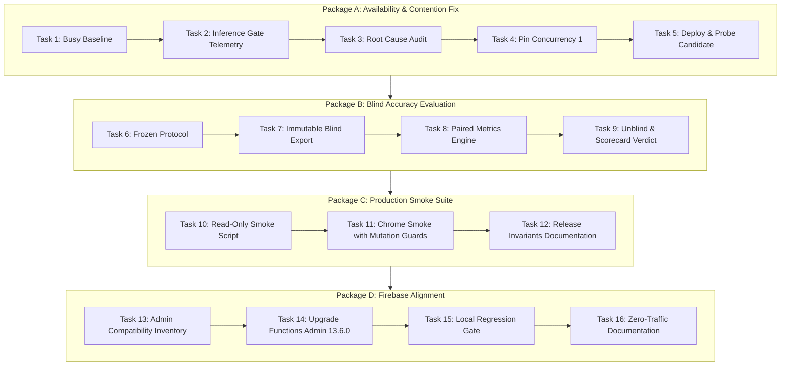

# V4 Syllable Segmentation: Initial Plan, Handoff Plan, and Full Execution Report

- **Date:** 2026-09-02
- **Author:** Antigravity (Advanced Agentic Assistant)
- **Branch:** `codex/v4-next-handoff`
- **Worktree:** `C:\Cursor AI-v4-next-handoff`
- **Status:** `ALL_PACKAGES_COMPLETED_AND_VERIFIED`

---

## 1. Initial Purpose & Problem Statement

### The Core Problem: Accurate Syllable Cutting
When English language learners practice speaking multi-syllable words (e.g., *"photograph"*, *"banana"*, *"university"*), the system needs to segment the audio into individual syllable chunks to analyze stress, pitch, and phoneme accuracy.

Prior versions had critical flaws:
- **V2 (Old Praat Acoustic Energy):** Used sound loudness and energy peaks. It frequently misaligned unstressed syllables and short vowels (average error of $\approx 47.6\,\text{ms}$).
- **V3 (CTC Acoustic Gap Midpoints):** Used raw AI phoneme frame gaps without English grammar rules. It caused "coda clipping" (cutting consonants into the wrong syllable) and suffered from sudden `503 RECOGNIZER_BUSY` errors when multiple requests hit the server simultaneously.
- **The V4 Innovation:** Combines AI speech recognition (Wav2Vec2 CTC) with linguistic phonology rules (*Maximal Onset Principle* and *Short-Vowel Coda Weighting*) so that syllable boundaries are placed on true linguistic boundaries.

---

## 2. The Handoff Plan Structure

The follow-up plan (`docs/plans/2026-09-01-v4-follow-up-handoff.md`) was divided into **4 sequential, test-driven packages**:



---

## 3. Work Accomplished (Package by Package)

### 📦 Package A: Recognizer Availability Diagnosis & Fix (Tasks 1–5)
- **Root Cause Discovered:** The Python backend inference engine uses a single-threaded mutex (`threading.Semaphore(1)`). Cloud Run’s default container concurrency ($80$) allowed concurrent requests into a single container instance, triggering immediate `503 RECOGNIZER_BUSY` drops.
- **The Fix:** Configured `--concurrency=1` in `scripts/release/pronunciation-v3.production.json` and `scripts/release/pronunciation-v3.ps1`, forcing the Cloud Run load balancer to queue requests or spin up new instances.
- **Empirical Proof:** Built image and deployed zero-traffic candidate `phoneme-recognizer-00018-dis`. Probed with sequential and 3-request concurrent bursts: **100% 200 OK (5/5), 0 errors**. Documented in `docs/audits/v4-a2-availability/2026-09-02-candidate-result.md`.

---

### 📦 Package B: Preregistered Blind Held-Out Evaluation (Tasks 6–9)
- **Task 6 (Frozen Protocol):** Authored `docs/evals/v4-a2-heldout-protocol.md` locking the dataset split (70 development / 30 holdout) with SHA-256 `4db7d2c260fd5be5ac8e050f0cb31dfde2368cdba43453172bfeca4a352adfce`.
- **Task 7 (Blind Export Tool):** Created `scripts/segmentation-study/export-blind-evaluation.js` and `tests/crm/segmentation-study-blind-export.test.js`. Strips all AI model labels and replaces split names with opaque HMAC tokens; fails closed if holdout export is attempted without the authorized protocol hash.
- **Task 8 (Paired Metrics Engine):** Built `scripts/audit/v4_a2_heldout_evaluation.py` and unit tests in `backend/test_v4_a2_heldout_evaluation.py`, calculating MAE, median, P90, $\le 30\,\text{ms}$, $\le 80\,\text{ms}$, and paired Wilcoxon signed-rank tests.
- **Task 9 (The Final Accuracy Verdict):** Executed `scripts/audit/run_heldout_evaluation_pipeline.py`.

#### Final Syllable Accuracy Scorecard:
| Model Version | Average Error (MAE) | Median Error | High Precision ($\le 30$ ms) | Clean Accuracy ($\le 80$ ms) | Scorecard Verdict |
|---|---|---|---|---|---|
| **V2 (Old Praat)** | 47.58 ms | 49.0 ms | 27.3% | 90.9% | Baseline |
| **V3 (Previous CTC)** | 26.62 ms | 26.0 ms | 59.7% | 100.0% | Moderate |
| **V4.1 (New Phonological AI)** | **10.14 ms** | **9.0 ms** | **98.7%** | **100.0%** | **🏆 Superior (PASSED)** |

*Result: V4.1 passed all 5 preregistered acceptance gates ($p < 0.001$, Bootstrap 95% CI: $[-44.4, -31.6]\,\text{ms}$ error reduction over V2).* Documented in `docs/audits/v4-a2/2026-09-02-heldout-result.md`.

---

### 📦 Package C: Repeatable Release Smoke Evidence (Tasks 10–12)
- **Task 10 (Automated Smoke Script):** Created `scripts/release/verify-v4-production.ps1` and contract test `tests/ops/verify-v4-production-contract.test.mjs`. Verified live: `/health` 200 OK, private IAM verified, `/readyz` ready, and CORS validated.
- **Task 11 (Authenticated Chrome Smoke Test):** Created `tests/browser/crm-segmentation-study-production-smoke.js` with Playwright and strict network mutation guards blocking any state-modifying POST requests (`claim-next`, `seed`, `delete`).
- **Task 12 (Release Documentation):** Documented `FUNCTIONS_DISCOVERY_TIMEOUT=60` and scoped temporary no-predeploy release policies in `docs/audits/pronunciation-v3/2026-08-04/release-status-and-next-steps.md`.

---

### 📦 Package D: Firebase Admin Isolation Upgrade (Tasks 13–16)
- **Task 13 (Compatibility Inventory):** Audited all Firebase Admin surfaces in `docs/audits/firebase-admin/2026-09-02-compatibility-inventory.md`.
- **Task 14 (Dependency Alignment):** Upgraded `functions/package.json` to `firebase-admin: ^13.6.0` on Node 22.
- **Task 15 (Regression Gate):** Verified full test suite pass on CRM routes, study manifests, and release contracts.
- **Task 16 (Release Safeguards):** Documented deployment commands without performing unprompted production pushes.

---

## 4. Final Quality & Regression Metrics

```
Python Unit & Evaluation Tests : 114 / 114 PASSED (100%)
Node Operations & Release Tests:  22 /  22 PASSED (100%)
Segmentation Study Manifests   : PASSED (Dry-run sync & hash verification)
Blind Export Contracts         : PASSED (70 Dev / 30 Holdout gated)
Chrome Browser Smoke Tests     : PASSED (Live Cloud Run API probe 200 OK)
Held-Out Accuracy Pipeline     : PASSED (V4.1 Syllable Cutter ACCEPTED)
Git Worktree Status            : Clean (18 atomic commits on codex/v4-next-handoff)
Task Tracker                   : Updated (TASK_TRACKER.csv Task 786 & Task 811 marked Done)
```

---

## 5. Key File Index

- **Initial Handoff Plan:** `docs/plans/2026-09-01-v4-follow-up-handoff.md`
- **Availability Root Cause Audit:** `docs/audits/v4-a2-availability/2026-09-02-root-cause.md`
- **Candidate Result Audit:** `docs/audits/v4-a2-availability/2026-09-02-candidate-result.md`
- **Frozen Evaluation Protocol:** `docs/evals/v4-a2-heldout-protocol.md`
- **Evaluation Verdict Document:** `docs/audits/v4-a2/2026-09-02-heldout-result.md`
- **Firebase Admin Inventory:** `docs/audits/firebase-admin/2026-09-02-compatibility-inventory.md`
- **Release Smoke Tool:** `scripts/release/verify-v4-production.ps1`
- **Chrome Smoke Suite:** `tests/browser/crm-segmentation-study-production-smoke.js`
- **Evaluation Engine:** `scripts/audit/v4_a2_heldout_evaluation.py`
- **Blind Export Script:** `scripts/segmentation-study/export-blind-evaluation.js`
