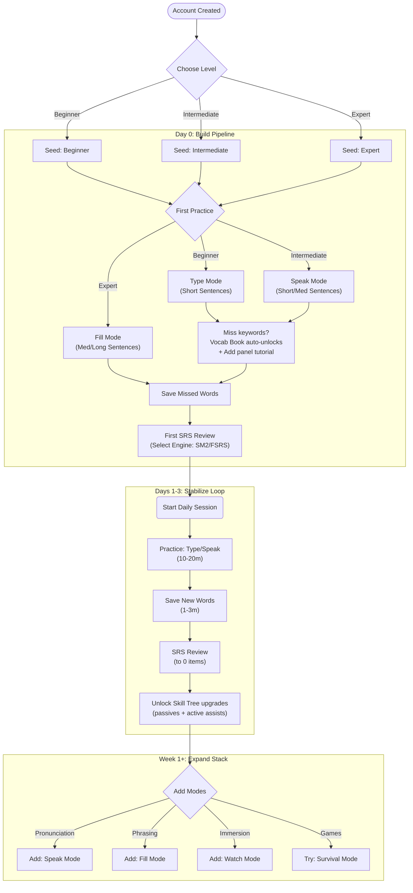

# New User Workflow (Post Level Selection)

**Status**: Draft
**Owner**: Admin
**Last updated**: 2026-02-17

This document is a **new-user guide** written as a workflow/roadmap.

## 0. Starting Point (Assumption)

You have already:

1. Created an account and logged in.
2. Chosen an initial English level in the "Choose Your English Level" modal:
   - Beginner
   - Intermediate
   - Expert

At this point the app reloads and seeds Smart Difficulty (CEFR baseline) from your selection.

## 1. UI Map (Where to click)

- Mode cards (main dashboard): Type, Speak, Fill, Watch, Notes, Pronounce, Survival.
- Progress panel (left toggle): shows stats, next goal, recent activity.
- Vocabulary Book panel (right toggle): bookmarking + frequently missed words.
  - Unlocks automatically on missed keywords in Type/Speak for authenticated users.
  - Guests can still use manual add + local Vocabulary/SRS (browser-only persistence) and see a gentle login nudge for cloud sync.
- Account panel: profile, coins/XP, and the entry point to the Skill Tree (Journey).
- Smart Difficulty badge: opens the Adaptive Engine modal (CEFR level, recent accuracy, adjustments).

## 2. Roadmap Summary (What to do first, next, later)

### First (Day 0): Build your "learning pipeline"

1. Do a short Type session to generate missed words
2. When the “Add to Vocabulary” panel appears, save the words you want to keep
3. Start your first SRS Review session

### Level-based defaults (first sessions)

Use these as training wheels. Smart Difficulty will adapt after you have real attempts logged.

| If you chose | Start with | Sentence length | Success criteria |
| --- | --- | --- | --- |
| Beginner | Type Mode | Short | You understand the corrections and save missed words |
| Intermediate | Type Mode -> Speak Mode | Short/Medium | You can repeat the sentence clearly and fix 1-2 recurring errors |
| Expert | Type Mode -> Fill Mode | Medium/Long | You can get clean attempts with minimal hints and stable accuracy |

### Next (Days 1-3): Stabilize the daily loop

1. Type (or Speak) a few items
2. Save missed words
3. Do SRS Review until "0 words due"
4. Spend coins on 1-2 Skill Tree upgrades that reduce friction (hints, slow audio, etc.)

### Later (Week 1+): Expand into the full stack

- Add Speak Mode (pronunciation + recall under pressure)
- Add Fill Mode (collocations + usage patterns)
- Add Watch/Notes Mode (real-world comprehension + extraction)
- Add Pronounce Mode (deep, technical feedback when you want it)
- Try Survival Mode (optional "game runs" after your daily SRS is done)

## 3. Workflow Flowchart

## 4. "Day 0" Checklist (Concrete, beginner-friendly)

- 1) Open Type Mode and run the tutorial if it appears.
- 1) Do 3-5 questions. Use hints only when stuck.
- 1) When the "Add to Vocabulary Book" modal appears, save the words that:
  - you missed
  - you can imagine using in real life
- 1) Open Vocabulary Book panel -> click "View All Items" -> go to "Vocabulary Practice".
- 1) Start SRS Review:
  - pick SM2 if you want the simplest default
  - do reviews until you are at 0 due words (or stop after 5-10 minutes)
  - if no words are due yet, the session should show "Early review" so it doesn’t look broken

## 5. Daily Routine (Recommended 15-30 minutes)

1. Practice block (10-20 min)
   - Type Mode OR Speak Mode (alternate days is fine)
2. Capture block (1-3 min)
   - Save missed words into Vocabulary Book
3. Retention block (5-10 min)
   - SRS Review until "0 due" (or timebox)
4. Optional (0-10 min)
   - Fill Mode for collocations, or Pronounce Mode for targeted corrections

## 6. Weekly Routine (10 minutes)

- Open the Account/Proficiency dashboard and confirm your CEFR badges are trending upward.
- Open Smart Difficulty (Adaptive Engine) and sanity-check:
  - your current level is reasonable
  - your recent accuracy is not constantly red (too hard) or always perfect (too easy)
- Spend coins on 1-2 Skill Tree upgrades that match your friction points:
  - If you struggle to hear: slow audio / replay assists
  - If you struggle to spell: hint ladder improvements
  - If you overuse reveal: earn passives that reward clean attempts (via Skill Tree)

## 7. Notes (How the app behaves)

- Your level selection seeds Smart Difficulty (CEFR baseline).
- Sentence Length Filter and Difficulty Filter unlock via the Skill Tree (Listening passives).
- Vocabulary Book + SRS work in guest-local mode for Day 0; logging in upgrades persistence to Firestore sync.
- Survival Mode is available by default.
- Writing Challenge is triggered during SRS when you get a word correct and it is eligible (POS-based).
- AI features are optional; the core loop works without them.
