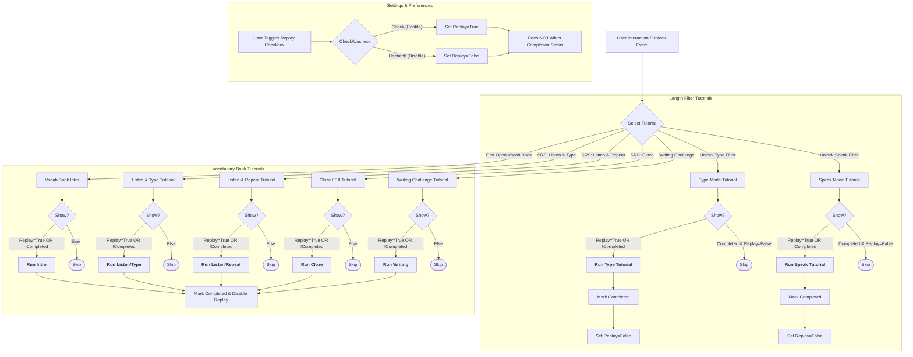

# Tutorial System Flowchart

This flowchart visualizes the logic for every tutorial currently implemented in the application, including triggers, decision logic, and completion states.

## Tutorial List & Triggers

| Tutorial Name | Trigger | File |
| :--- | :--- | :--- |
| **Length Filter (Type)** | Unlocking the length filter in Type Mode | `tutorial.js` |
| **Length Filter (Speak)** | Unlocking the length filter in Speak Mode | `tutorial.js` |
| **Vocab Book Intro** | Unlocking/Opening the Vocab Book for the first time | `vocab-tutorial.js` |
| **Listen & Type** | Starting a "Listen & Type" SRS session | `vocab-tutorial.js` |
| **Listen & Repeat** | Starting a "Listen & Repeat" SRS session | `vocab-tutorial.js` |
| **Cloze (Fill)** | Starting a "Fill in the Blank" SRS session | `vocab-tutorial.js` |
| **Writing Challenge** | Triggering the Writing Challenge event in SRS | `vocab-tutorial.js` |

## Recent Fixes

- **Replay Logic**: Fixed a critical flaw in `tutorial.js` where disabling replay would incorrectly mark a tutorial as "completed" for new users.
- **State Safety**: Enabling replay no longer deletes the "Completed" history.
- **Conflict Resolution**: `tutorial.js` no longer attempts to handle 'Writing' or 'Cloze' settings, ceding control to the specialized `vocab-tutorial.js`.
