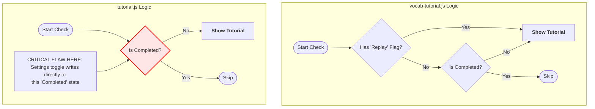

# Tutorial System Logic Analysis

## 1. Decision Tree: Logic Flow Comparison

The following diagram compares how the two systems decide whether to run a tutorial.

## 2. Identified Logical Flaws

### 🔴 Critical Flaw: The "Replay" Checkbox Trap (`tutorial.js`)

There is a logic error in `initSettings` (lines 550-573) of `tutorial.js` that can accidentally prevent new users from ever seeing the tutorial.

* **The Logic:** The code sets the checkbox state based on `!isCompleted`.
  * *If User is New:* `isCompleted` is `false`. The "Replay Tutorial" box defaults to **Checked**.
* **The Trap:** If a new user **unchecks** that box (thinking "I don't need to replay"), the event listener immediately runs `forceCompleteTutorial()`.
* **Result:** The system now thinks they have finished the tutorial. When they finally go to the feature, **the tutorial will never show up.**

### 🟠 Flaw: Destructive State Management

In `tutorial.js`, enabling "Replay" actually **deletes** the proof that the user ever finished it (`localStorage.removeItem`).

* **Issue:** You cannot distinguish between "User who is replaying" and "Total Beginner".
* **Better Approach (used in `vocab-tutorial.js`):** maintain two separate flags: `lengthFilterTutorialCompleted` (permanent) and `lengthFilterReplayEnabled` (temporary).

### 🟡 Flaw: Timing Vulnerability

`tutorial.js` uses hardcoded timeouts (`setTimeout(..., 100)`) to wait for UI elements to appear.

* **Risk:** On slower devices/browsers, if the dropdown takes 105ms to animate, the tutorial spotlight will calculate the position of a hidden element (0x0 pixels) and appear in the wrong place (usually top-left).
